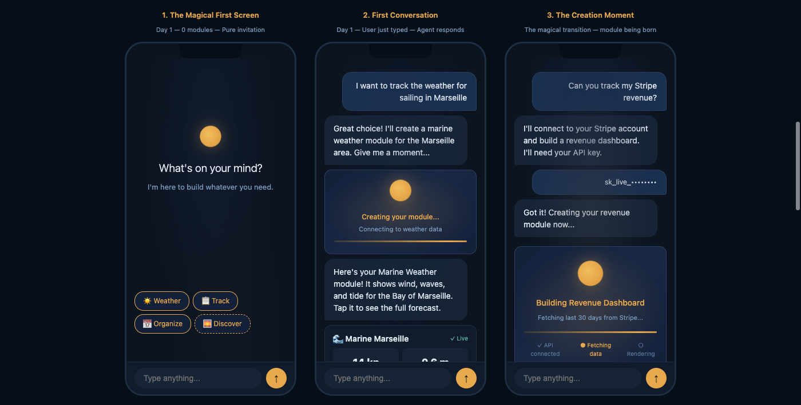
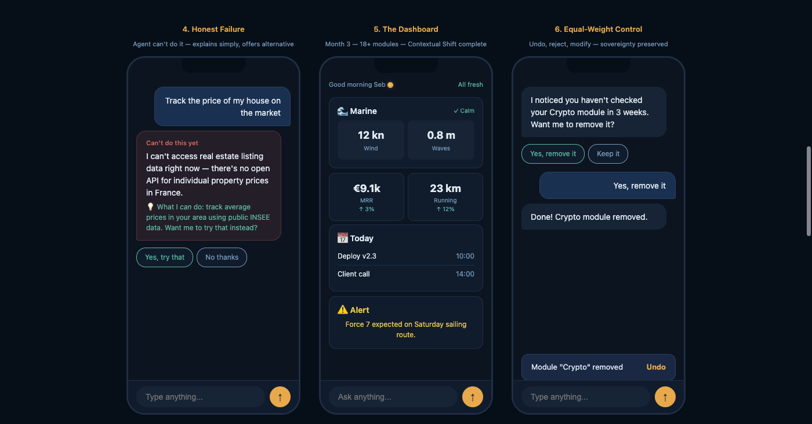
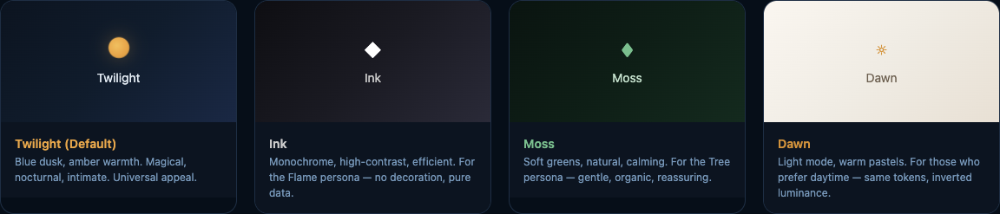

# Self-App

> A mobile app that builds itself entirely through conversation. An AI agent discovers APIs, creates module definitions, fetches data, and sends rendering instructions to the client. One million users should have one million different apps.

<p align="center">
  
</p>

## Project Status

```
[▓▓▓░░░░░░░░░░░░░░░░░] 4/56 stories done (7%)
```

| Phase | Stories | Done | Status |
|-------|---------|------|--------|
| First Light | 18 | 4 | **In Progress** |
| MVP | 19 | 0 | Backlog |
| Growth | 19 | 0 | Backlog |

**Current focus:** Epic 1 — Project Bootstrap & Developer Connection
**Next up:** Story 1.4 — Mobile App Shell & WebSocket Connection

See the full [Roadmap](_bmad-output/implementation-artifacts/roadmap.md) and [Sprint Status](_bmad-output/implementation-artifacts/sprint-status.yaml) for details.

## Tech Stack

| Layer | Technology |
|-------|-----------|
| Mobile | React Native (Expo SDK 54) |
| Backend | Python 3.14 / FastAPI |
| Database | SQLite (WAL) + sqlite-vec |
| State | Zustand |
| Schema | Zod (source of truth) → JSON Schema → Pydantic |
| Protocol | WebSocket-only |
| Monorepo | pnpm workspaces |
| CI | GitHub Actions |

## Project Structure

```
self-app/
├── apps/
│   ├── mobile/             # Expo React Native app
│   └── backend/            # Python FastAPI server
├── packages/
│   └── module-schema/      # Zod schema (shared contract)
├── scripts/                # Dev tooling
├── .github/workflows/      # CI pipeline
├── pnpm-workspace.yaml
└── tsconfig.json
```

## Getting Started

### Prerequisites

- **Node.js** 22+
- **pnpm** 10.30+ (`corepack enable`)
- **Python** 3.14+ with [uv](https://docs.astral.sh/uv/)
- **Expo Go** on your mobile device (for development)

### Install & Run

```bash
# Install JS dependencies
pnpm install

# Install Python dependencies
cd apps/backend && uv sync && cd ../..

# Generate shared schema (Zod → JSON Schema → Pydantic)
pnpm schema:generate

# Start both mobile and backend in parallel
pnpm dev
```

### Individual Services

```bash
pnpm dev:mobile       # Expo dev server
pnpm dev:backend      # FastAPI with hot reload
```

### Tests

```bash
pnpm test             # All tests (schema + backend)
pnpm test:schema      # Module schema tests only
pnpm test:backend     # Python backend tests only
pnpm typecheck        # TypeScript type checking
```

## Planning Documents

These documents define the product vision, architecture, and implementation plan:

| Document | Description |
|----------|-------------|
| [Product Brief](_bmad-output/planning-artifacts/product-brief-self-app-2026-02-21.md) | Initial product vision and market analysis |
| [PRD](_bmad-output/planning-artifacts/prd.md) | Full Product Requirements Document (61 FRs, 38 NFRs) |
| [PRD Validation Report](_bmad-output/planning-artifacts/prd-validation-report.md) | Quality assessment of the PRD |
| [Architecture](_bmad-output/planning-artifacts/architecture.md) | Technical architecture, ADRs, and consistency patterns |
| [UX Design Specification](_bmad-output/planning-artifacts/ux-design-specification.md) | UX strategy, Twilight theme, Metamorphosis interface |
| [Epics & Stories](_bmad-output/planning-artifacts/epics.md) | Complete breakdown: 15 epics, 56 stories |
| [Implementation Readiness](_bmad-output/planning-artifacts/implementation-readiness-report-2026-02-23.md) | Cross-document alignment validation |

## Implementation Artifacts

| Document | Description |
|----------|-------------|
| [Roadmap](_bmad-output/implementation-artifacts/roadmap.md) | Visual project roadmap with all phases |
| [Sprint Status](_bmad-output/implementation-artifacts/sprint-status.yaml) | Current sprint tracking (machine-readable) |
| [Story 1.1 — Monorepo & Schema](_bmad-output/implementation-artifacts/1-1-initialize-monorepo-and-module-definition-schema.md) | Done |
| [Story 1.1b — CI Pipeline](_bmad-output/implementation-artifacts/1-1b-ci-pipeline.md) | Done |
| [Story 1.2 — Backend Skeleton](_bmad-output/implementation-artifacts/1-2-backend-skeleton-and-single-command-deployment.md) | Done |
| [Story 1.3 — LLM Provider Abstraction](_bmad-output/implementation-artifacts/1-3-llm-provider-abstraction-and-byok-configuration.md) | Done |

## Key Concepts

- **Module** — A self-contained UI unit (weather widget, task list, etc.) created autonomously by the AI agent based on user conversation.
- **SDUI** — Server-Driven UI. The backend sends rendering instructions; the mobile app renders them using a primitive registry.
- **Genome** — A portable, shareable configuration that captures a user's entire app setup (modules, preferences, persona).
- **Orb** — The visual brand mark representing the AI agent's presence and state.
- **Metamorphosis** — The interface pattern where the screen transitions from chat-dominant to dashboard-dominant as modules are created.

## Design — Twilight Theme

The app uses the **Twilight** theme: deep navy backgrounds with warm amber accents — like a lantern in the dark. See the full [UX Twilight Deep Dive](_bmad-output/planning-artifacts/ux-twilight-deep-dive.html) for the interactive exploration.

<p align="center">
  
</p>

**Four theme variants** share the same token structure — only values change:

<p align="center">
  
</p>

| Theme | Description |
|-------|------------|
| **Twilight** (default) | Blue dusk, amber warmth. Magical, nocturnal, intimate. |
| **Ink** | Monochrome, high-contrast, efficient. For the Flame persona. |
| **Moss** | Soft greens, natural, calming. For the Tree persona. |
| **Dawn** | Light mode, warm pastels. Same tokens, inverted luminance. |

## License

Private project.
