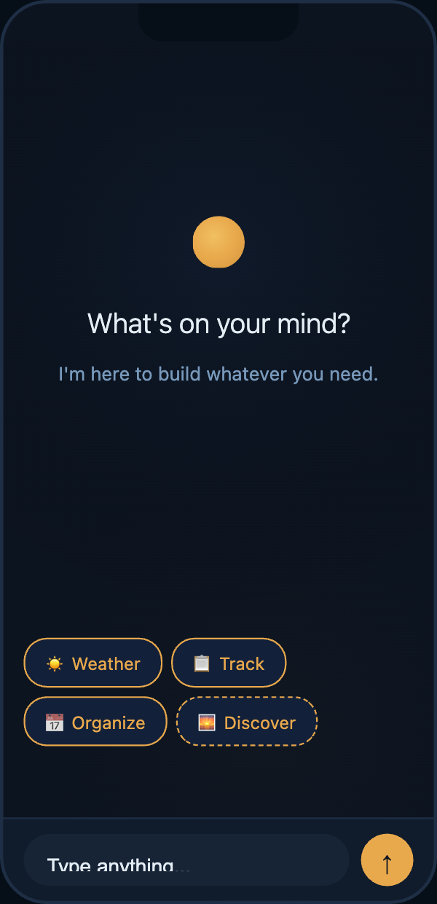
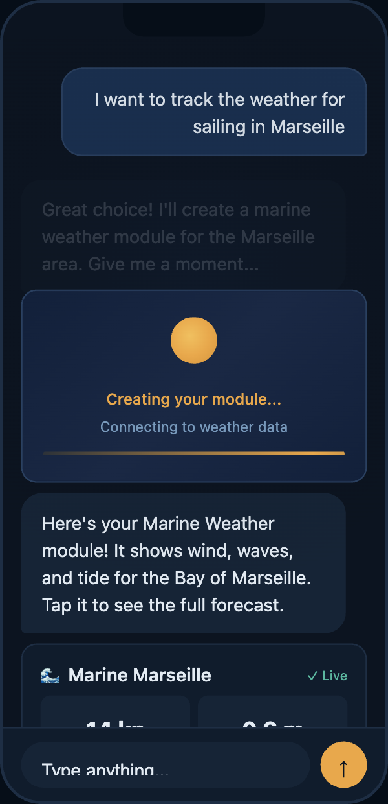
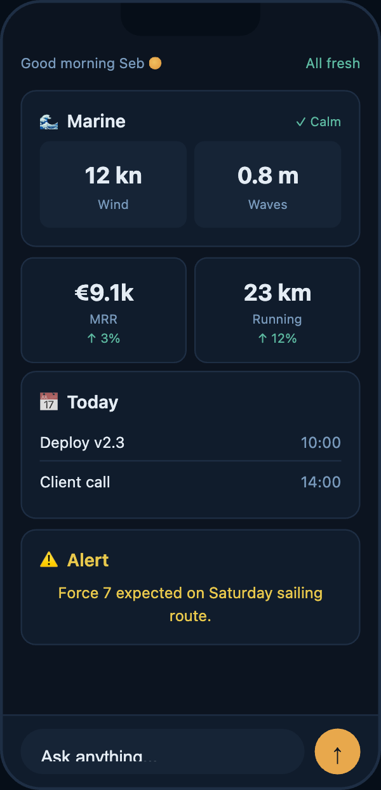

# Self

[](https://github.com/SebastienTr/self-app/actions/workflows/ci.yml)

**An AI-powered mobile app that starts empty and builds itself entirely through conversation.**

<p align="center">
  
  &nbsp;&nbsp;
  
  &nbsp;&nbsp;
  
</p>

<p align="center">
  <em>Empty state &rarr; First conversation &rarr; Your personal dashboard</em>
</p>

## What Self Does

Most apps decide what you can do before you open them. Self flips that:

- **You talk, it builds.** Describe a need in plain language — the agent discovers APIs, creates a native UI module, and fetches live data. No templates, no app store.
- **Server-Driven UI.** The backend sends structured rendering instructions; the mobile client renders real native components. No webviews.
- **Morphing interface.** The screen transforms from full-chat (0 modules) to a module dashboard (9+) — one continuous experience, no navigation.
- **4-layer memory.** Identity file (SOUL.md) + key-value store + vector episodes + semantic dedup. The agent remembers context without repeating itself.
- **5 LLM providers, one abstraction.** Claude, DeepSeek, Codex — swap with a single config change. CLI mode uses Claude Max at $0.
- **Self-hosted, BYOK, open source.** SQLite database + SOUL.md plain text file. Backup = copy a folder. Runs on a Raspberry Pi.

## Tech Stack

| Layer | Technology |
|-------|-----------|
| Mobile | React Native (Expo SDK 54) |
| Backend | Python 3.14 / FastAPI |
| Database | SQLite (WAL) + sqlite-vec |
| State | Zustand |
| Schema | Zod → TypeScript types → Pydantic models |
| Protocol | WebSocket-only (15 typed messages) |
| Monorepo | pnpm workspaces |
| CI | GitHub Actions |

## Project Status

```
[▓▓▓▓░░░░░░░░░░░░░░░░] 11/56 stories (20%)
```

| Phase | Stories | Done | Status |
|-------|---------|------|--------|
| First Light | 18 | 11 | **In Progress** |
| MVP | 19 | 0 | Backlog |
| Growth | 19 | 0 | Backlog |

**Current focus:** Story 3.4 — Module Creation End-to-End
**Next milestone:** Story 3.4 — First Module Creation End-to-End

See the full [Roadmap](_bmad-output/implementation-artifacts/roadmap.md) for details.

## Project Structure

```
self-app/
├── apps/
│   ├── mobile/             # Expo React Native thin client
│   └── backend/            # Python FastAPI + agent orchestration
├── packages/
│   └── module-schema/      # Zod schema (single source of truth)
├── scripts/                # Dev tooling
├── .github/workflows/      # CI pipeline
├── self.sh                 # Dev service launcher
├── pnpm-workspace.yaml
└── tsconfig.json
```

## Getting Started

### Prerequisites

- **Node.js** 22+
- **pnpm** 10.30+ (`corepack enable`)
- **Python** 3.14+ with [uv](https://docs.astral.sh/uv/)
- **Expo Go** on your mobile device (for development)

### Install & Run

```bash
# Install JS dependencies
pnpm install

# Install Python dependencies
cd apps/backend && uv sync && cd ../..

# Start all services (generates schema, kills zombies, launches backend + mobile)
./self.sh
```

### Dev Script (`self.sh`)

```bash
./self.sh              # Kill zombies + start all services
./self.sh --backend    # Backend only
./self.sh --mobile     # Mobile only
./self.sh --kill       # Kill all services and exit
./self.sh --status     # Show what's running
./self.sh --no-schema  # Skip schema:generate
./self.sh --reset      # Purge backend DB (forces re-pairing on mobile)
./self.sh --port 3000  # Override backend port (default: 8000)
```

### Tests

```bash
pnpm test             # All tests (schema + backend)
pnpm test:schema      # Module schema tests only
pnpm test:backend     # Python backend tests only
pnpm typecheck        # TypeScript type checking
```

## Architecture Highlights

**3-layer component model** — Shell (static chrome: Orb, ChatInput) → Bridge (lifecycle wrappers: ErrorBoundary, CreationCeremony) → SDUI (pure stateless primitives: props in, JSX out).

**Constrained composition** — The agent doesn't assemble UI freely. It picks from validated layout templates (`metric-dashboard`, `data-card`, `simple-list`…), preventing rendering chaos while preserving autonomy.

**Schema contract** — Zod defines the module spec once. TypeScript types are inferred at compile time, Pydantic models are auto-generated. `snake_case` on the wire, `camelCase` in TS, converted at a single boundary.

**Cost protection** — Rate limit (10 LLM calls/min), circuit breaker (3 failures → 60s cooldown), budget alerts ($5/day default). Every call logged in `llm_usage` table.

## Key Concepts

- **Module** — A self-contained UI unit (weather widget, task list, budget tracker…) created by the agent from conversation.
- **SDUI** — Server-Driven UI. The backend sends rendering instructions; the mobile app maps them to native components via a primitive registry.
- **Orb** — The amber pulsing circle that embodies the agent's presence and state.
- **Metamorphosis** — The interface morph from chat-dominant (0 modules) to dashboard-dominant (9+ modules).
- **Genome** — A portable config capturing an entire app setup — modules, preferences, persona — shareable between users.
- **Persona** — Three agent archetypes (Flame / Tree / Star) that change behavior, autonomy level, and communication style — not just cosmetics.

## Design — Twilight Theme

Deep navy backgrounds with warm amber accents — like a lantern in the dark.

<p align="center">
  
</p>

| Theme | Description |
|-------|------------|
| **Twilight** (default) | Blue dusk, amber warmth. Magical, nocturnal, intimate. |
| **Ink** | Monochrome, high-contrast, efficient. |
| **Moss** | Soft greens, natural, calming. |
| **Dawn** | Light mode, warm pastels. Same tokens, inverted luminance. |

See the [UX Twilight Deep Dive](_bmad-output/planning-artifacts/ux-twilight-deep-dive.html) for the interactive exploration.

## Documentation

<details>
<summary><strong>Planning documents</strong> — product vision, architecture, UX</summary>

| Document | Description |
|----------|-------------|
| [Product Brief](_bmad-output/planning-artifacts/product-brief-self-app-2026-02-21.md) | Initial product vision and market analysis |
| [PRD](_bmad-output/planning-artifacts/prd.md) | Full Product Requirements Document (61 FRs, 38 NFRs) |
| [PRD Validation Report](_bmad-output/planning-artifacts/prd-validation-report.md) | Quality assessment of the PRD |
| [Architecture](_bmad-output/planning-artifacts/architecture.md) | Technical architecture, ADRs, and consistency patterns |
| [UX Design Specification](_bmad-output/planning-artifacts/ux-design-specification.md) | UX strategy, Twilight theme, Metamorphosis interface |
| [Epics & Stories](_bmad-output/planning-artifacts/epics.md) | Complete breakdown: 15 epics, 56 stories |
| [Implementation Readiness](_bmad-output/planning-artifacts/implementation-readiness-report-2026-02-23.md) | Cross-document alignment validation |

</details>

<details>
<summary><strong>Implementation artifacts</strong> — roadmap, sprint status, stories</summary>

| Document | Description |
|----------|-------------|
| [Roadmap](_bmad-output/implementation-artifacts/roadmap.md) | Visual project roadmap with all phases |
| [Sprint Status](_bmad-output/implementation-artifacts/sprint-status.yaml) | Current sprint tracking (machine-readable) |
| [Story 1.1 — Monorepo & Schema](_bmad-output/implementation-artifacts/1-1-initialize-monorepo-and-module-definition-schema.md) | Done |
| [Story 1.1b — CI Pipeline](_bmad-output/implementation-artifacts/1-1b-ci-pipeline.md) | Done |
| [Story 1.2 — Backend Skeleton](_bmad-output/implementation-artifacts/1-2-backend-skeleton-and-single-command-deployment.md) | Done |
| [Story 1.3 — LLM Provider Abstraction](_bmad-output/implementation-artifacts/1-3-llm-provider-abstraction-and-byok-configuration.md) | Done |
| [Story 1.4 — Mobile App Shell & WebSocket](_bmad-output/implementation-artifacts/1-4-mobile-app-shell-and-websocket-connection.md) | Done |
| [Story 1.5 — Offline Message Queue & Cached Data](_bmad-output/implementation-artifacts/1-5-offline-message-queue-and-cached-data-rendering.md) | Done |
| [Story 1.6 — Session Auth & Pairing](_bmad-output/implementation-artifacts/1-6-session-authentication-and-mobile-backend-pairing.md) | Done |
| [Story 3.1 — SDUI Primitive Registry](_bmad-output/implementation-artifacts/3-1-sdui-primitive-registry-and-simple-primitives.md) | Done |
| [Story 3.2 — Composite Primitives](_bmad-output/implementation-artifacts/3-2-composite-primitives-card-list.md) | Done |
| [Story 3.3 — Module Rendering Pipeline](_bmad-output/implementation-artifacts/3-3-module-rendering-pipeline.md) | Done |
| [Story 2.1 — Real-Time Chat Interface with Streaming](_bmad-output/implementation-artifacts/2-1-real-time-chat-interface-with-streaming.md) | Done |

</details>

Built with the [BMAD](https://github.com/bmad-sim/bmad-ecosystem) framework for AI-driven product development.

## License

MIT — see [LICENSE](LICENSE).
