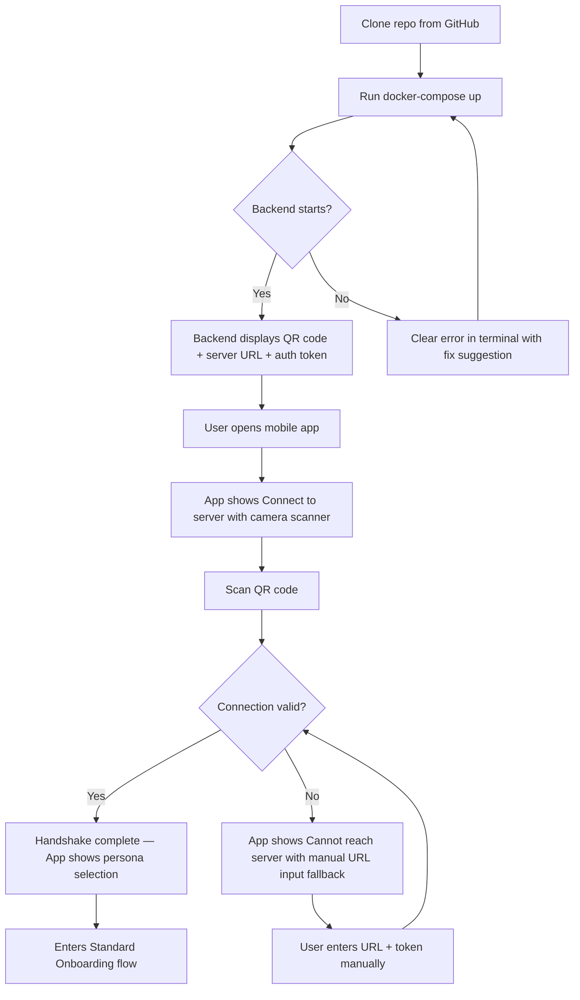
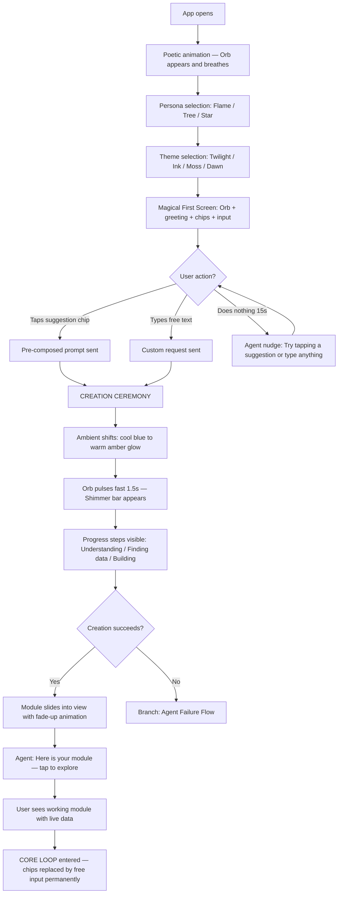
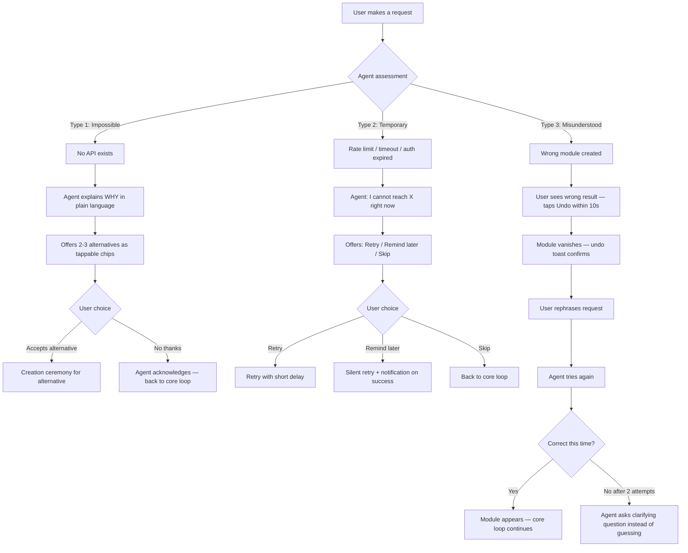
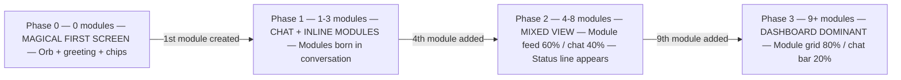

# UX Design Specification self-app

**Author:** Seb
**Date:** 2026-02-21

---

## Executive Summary

### Project Vision

Self is an open-source, mobile-first application that starts as an empty shell and constructs itself entirely around each user's needs through AI-driven conversation. A Python backend hosts an autonomous agent that discovers APIs, creates module definitions, fetches data, and delivers structured rendering instructions to a React Native thin client via SDUI (Server-Driven UI). The app's core promise: one million users, one million different apps.

The UX challenge is unprecedented: designing for an application whose content, layout, and functionality are entirely generated by an AI agent — not pre-designed. Every UX decision must support autonomous creation while maintaining user trust, control, and emotional connection.

### Target Users

**Primary Personas:**

| Persona | Profile | UX Archetype | Interaction Style | Module Density |
|---------|---------|-------------|-------------------|----------------|
| **Seb** | Back-end dev, entrepreneur, sailor | Power user — minimal UI, data-dense | Autonomous (Flame) — gives agent full freedom | 25+ modules |
| **Clara** | Freelance illustrator, non-technical | Trust-first — colorful, emotional | Collaborative (Tree) — agent always asks first | 12 modules |
| **Marc** | Project manager, father, fitness | Optimizer — structured, metric-heavy | Autonomous but curated — actively trims | 18 modules |

**Secondary Personas:** Self-hoster (Alex), Genome cloner (Fatima), Curious explorer with no initial need (Yuki)

**Key UX Insight:** The three primary personas will produce radically different apps from the same starting point. The design system must accommodate dense technical dashboards (Seb), visual emotional layouts (Clara), and structured tabbed interfaces (Marc) without prescribing any specific outcome.

### Key Design Challenges

Design challenges are prioritized by product risk — failure at the top kills the product regardless of success below.

#### 🔴 Critical — The First Module Moment (5-Minute Magic)

The app starts with nothing. Within 5 minutes, the user must see a working, data-driven module rendered from their natural language request. If this moment fails — slow, ugly, or wrong — the product fails. D7 retention, second session rate, and onboarding completion all hinge on this single interaction. This is not one challenge among five; it is the challenge that gates everything else.

The module creation micro-moment IS the product. The loading state, the transition from "agent is working" to "module appears" — this must feel like witnessing creation, not waiting for a spinner. An animation of the module being "born" (data flowing in, layout composing) transforms a technical process into an emotional experience.

#### 🔴 Critical — Trust in AI Autonomy

The agent creates UI modules the user never designed. This is a new user behavior with no market precedent. UX must build trust progressively:

- **Trust-before-access** (FR54): demonstrate value from conversation before requesting any permissions
- **Easy undo** (FR53): 60-second reversal window as a safety net, not a setback
- **Transparent failure** (FR14): explain why, offer alternatives, never oversell
- **Visible agent reasoning**: show what the agent found, what it chose, why

If users reject agent-created modules (< 80% adoption rate), the core value proposition collapses.

#### 🟠 High — Multiple Entry Architecture

The onboarding is not a single flow — it is a decision tree with three fundamentally different entry paths:

| Entry Path | User Profile | First Experience | UX Priority |
|-----------|-------------|------------------|-------------|
| **Empty shell** | Seb, Yuki — new users with no genome | Conversation → first module creation | Speed to first module |
| **Genome import** | Clara, Fatima — arriving via shared link | Pre-existing modules → guided review → personalization | Familiarity without lock-in |
| **Self-hosted pairing** | Alex — QR code to own backend | Technical setup → power user configuration | Efficiency and transparency |

Each path must feel native and intentional, not like a branching afterthought.

#### 🟠 High — App Metamorphosis (Chat → Dashboard)

Self changes identity as the user matures. Day 1, Self IS a chat — the conversation is the entire app. Month 3, Self IS a dashboard with 25 modules and a chat accessible on the side. The design must accompany this progressive metamorphosis:

- **Day 1 (0 modules)**: Full-screen conversation, inviting empty state
- **Week 1 (2-5 modules)**: Conversation remains primary, modules appear as results
- **Month 1 (10+ modules)**: Dashboard becomes primary, conversation becomes a tool
- **Month 3 (18-25 modules)**: Full dashboard with organized categories, conversation on demand

This is not a toggle between two tabs. It is a continuous shift in the app's center of gravity.

#### 🟡 Medium — Emotional Accessibility

Technical accessibility (NFR30-33) covers screen readers, contrast, and touch targets. But emotional accessibility is equally critical for adoption. Clara, who "can't code," opening an app that "builds itself" can feel intimidating before it feels empowering. The agent's first words, the visual language, the tone of onboarding — these must be designed with the same rigor as an accessible button. The persona presets (Flame/Tree/Star) are the primary mechanism: Tree's patient, collaborative tone is an emotional accessibility feature for non-technical users.

#### 🟡 Medium — Radical Persona Divergence

The same design system must support Seb's 25-module technical dashboard and Clara's 12-module emotional canvas. Components must flex across density, color, complexity, and interaction style without becoming chaotic. The SDUI primitive library is the constraint and the enabler — flexible enough for radical diversity, consistent enough for visual coherence.

#### 🟢 Low — Biological Lifecycle Communication

Module vitality, dormancy, and death are powerful architectural concepts. The UX must present lifecycle transitions as natural and empowering (decluttering) rather than anxiety-inducing (loss). V1 can start with simple "unused module" indicators and cleanup recommendations (FR27) without surfacing the full biological metaphor.

### Design Opportunities

1. **Onboarding as Emotional Origin Story** — Persona selection (Flame/Tree/Star) is a rare moment of emotional investment in an app. The "birth animation" can create immediate attachment — a differentiator against cold, utilitarian apps. This is Self's first impression and its most memorable.

2. **Module Creation as Visible Magic** — Unlike hidden AI assistants, Self's agent produces immediate visual results. The creation process (API discovery → module definition → native render) can be surfaced as transparent co-creation. Showing the agent "thinking" — finding data sources, composing layout — transforms a technical pipeline into a moment of wonder. The loading-to-render transition is the product's signature interaction.

3. **App as Personal Identity** — Every Self is unique. The UX can celebrate this uniqueness — making "this is MY app, nobody else has this" a felt experience at every interaction. The genome is not just a config export; it is the user's digital identity crystallized into a shareable format.

## Core User Experience

### Defining Experience

The core interaction loop of Self is: **speak → agent creates → module appears → use → speak again**.

There is no menu, no wizard, no drag-and-drop builder. The conversation IS the builder. The user describes a need in natural language, the agent autonomously discovers data sources, creates a module definition, and the SDUI rendering engine displays native UI components — all within a single conversational exchange.

This loop evolves with user maturity:

| Phase | Loop Character | User Role | Agent Role |
|-------|---------------|-----------|------------|
| **Day 1** (0 modules) | Explicit — user asks, agent delivers | Initiator | Executor |
| **Week 2** (5+ modules) | Mixed — user asks AND agent suggests | Collaborator | Partner |
| **Month 1** (10+ modules) | Proactive — agent proposes, user validates | Curator | Anticipator |
| **Month 3** (18-25 modules) | Symbiotic — agent anticipates, user lives in the result | Inhabitant | Caretaker |

The critical design implication: the app's primary interaction mode shifts from **input-heavy** (typing, conversing) to **consumption-heavy** (glancing, scanning dashboards). The UX must fluidly support both extremes and every state between.

### Platform Strategy

| Dimension | Decision | Rationale |
|-----------|----------|-----------|
| **Framework** | React Native (Expo) | Cross-platform parity (iOS 16+ / Android 10+), solo dev efficiency |
| **Interaction model** | Touch-first, keyboard-heavy at start | Chat requires typing; modules require touch/scroll/tap |
| **Communication** | WebSocket (persistent) + REST fallback | Real-time module updates, streaming agent responses |
| **Offline** | Cache-first — last known state displayed, inputs queued | No blank screen on disconnection; no offline intelligence in V1 |
| **Voice input** | Deferred to V3 | Natural use case exists (hands-free scenarios) but not MVP-critical |
| **Rendering** | SDUI — native primitives composed from server specs | No app store update for new module types; agent composes freely |

**Platform-specific adaptations:** Navigation patterns follow platform conventions (bottom tabs iOS, material patterns Android). Push notification handling via APNs (iOS) and FCM (Android). All other behavior is cross-platform identical.

### Effortless Interactions

**Tier 1 — Must feel invisible:**

- **Opening the app and finding fresh data.** The heartbeat pre-computes content before the user's typical usage time. Opening Self at 7:15am with marine weather already updated at 6:50 — this is the "push" experience that replaces opening 6 separate apps. Zero user action required.
- **Module creation from conversation.** "Je veux la météo marine entre Audierne et Belle-Île" → rendered module in < 30 seconds. No configuration screens, no API setup dialogs, no form fields. Just language in, module out.

**Tier 2 — Must feel natural:**

- **Undoing agent actions.** FR53 gives a 60-second window. Undo must be a single tap — visible, obvious, no confirmation dialog. A safety net that feels like part of the flow, not an error recovery mechanism.
- **Connecting external services.** OAuth proxy (FR35) means Clara sees a "Connect" button and nothing else. No token fields, no redirect URI confusion, no technical vocabulary.
- **Module refresh.** Data updates silently in the background. The user sees a subtle "last updated" indicator, never a manual refresh button as primary interaction.

**Tier 3 — Must feel empowering:**

- **Asking the agent to modify a module.** "Show only days under force 4" refines the existing module through conversation — no settings screen, no filter UI. The agent understands context and updates in place.
- **Cleaning up unused modules.** "What haven't I used this month?" triggers a cleanup recommendation. The agent does the analysis; the user just decides.

### Critical Success Moments

**1. The First Module (make-or-break)**
The single most critical moment in the entire product. User types a natural language request → agent creates a module → native UI appears on screen. If this takes > 60 seconds, looks broken, or doesn't match the request — the user leaves and never returns. Target: < 30 seconds, visually polished, data-accurate. The creation animation must feel like witnessing something being born, not waiting for a process to complete.

**2. The Morning Open (retention driver)**
User opens Self and everything is already there — fresh, relevant, zero wait. This is the moment that replaces the 6-app morning routine. If cached data is stale or the screen is empty, the "app that works while you sleep" promise breaks. Target: 80%+ of app opens show pre-computed fresh data.

**3. The Unsolicited Module (trust milestone)**
The agent proposes a module the user never asked for — and it's relevant. This is the transition from tool to companion, from "I tell it what to do" to "it understands me." If the suggestion is irrelevant or intrusive, trust erodes. Target: 70%+ acceptance rate on agent proposals.

**4. The Honest Failure (trust through transparency)**
The agent can't fulfill a request (Marc's Pronote scenario). Instead of silent failure or vague error, it explains WHY, shows what it tried, and offers concrete alternatives. This moment builds more trust than a perfect track record. It proves the agent is honest, not just capable.

### Experience Principles

1. **Conversation is the interface.** Every capability is accessible through natural language. If a user needs to navigate to a settings screen to accomplish something, the UX has failed. The chat is not a feature — it is the primary interaction paradigm.

2. **Show, don't configure.** Modules appear as results of conversation, not as outputs of configuration wizards. The agent handles complexity; the user sees outcomes. Zero-configuration is the target for every feature.

3. **Fresh by default.** The app assumes responsibility for keeping content current. The user should never need to pull-to-refresh or wonder if data is stale. Heartbeat + crons + cache-first rendering make "already up to date" the default state.

4. **Trust is earned, not assumed.** No permission requests at first launch. No data access before demonstrating value. No autonomous actions before the user has experienced the agent's competence. Trust builds through a sequence: first module → repeated accuracy → first proactive suggestion → accepted proposal → autonomy.

5. **Graceful at every scale.** The app works with 0 modules (inviting empty state), 5 modules (growing dashboard), and 25 modules (organized workspace). No state feels broken, cluttered, or overwhelming. The design scales with the user's investment.

## Desired Emotional Response

### Primary Emotional Goals

Self's emotional design targets a progression from utility to attachment — proving competence first, earning emotional investment over time.

| Emotional Goal | Description | When It Matters |
|---------------|-------------|-----------------|
| **Wonder** | "It actually built what I described" — the moment natural language becomes visible reality | First module creation (Day 1) |
| **Recognition** | "It remembers me" — feeling understood without repeating yourself | First week of daily use |
| **Quiet Competence** | "It never asks the same thing twice" — a subtle realization, not a firework, that bridges wonder and intimacy | Week 2-3, the narrative midpoint |
| **Intimacy** | "It knows what I need before I ask" — the agent anticipates, not just responds | First unsolicited module proposal |
| **Ownership** | "This is MY app, nobody else has this" — the app becomes personal identity | Month 2-3, after significant customization |

**The Week 2-3 Emotional Gap:** Between the initial wonder (Day 1) and true intimacy (Month 1+), there is a narrative midpoint — the emotional equivalent of a TV series mid-season. The "Quiet Competence" goal fills this gap: the user realizes the agent has never repeated a question, never forgotten context, never needed reminding. This is not a dramatic moment — it is the absence of friction that becomes noticeable. It is the emotional bridge that carries retention through D7→D30.

The emotional relationship varies by persona and is not prescriptive:

- **Seb** experiences Self as a reliable, capable tool — a Swiss knife that sharpens itself. Attachment comes from competence and autonomy.
- **Clara** experiences Self as a creative companion — patient, supportive, almost like a digital collaborator who "gets" creative work. Attachment comes from emotional understanding.
- **Marc** experiences Self as an efficient partner — structured, honest, always improving. Attachment comes from shared optimization.

The design must support both relationships without forcing either. The persona presets (Flame/Tree/Star) are the mechanism: Flame produces tool-like interactions, Tree produces companion-like interactions, Star lets the user define their own emotional register.

### Emotional Journey Mapping

| Stage | Target Emotion | Risk Emotion | Design Response |
|-------|---------------|-------------|-----------------|
| **First open** | Curiosity + invitation | Confusion ("what is this?") | Poetic animation sets tone; persona choice creates investment; first agent message is warm and open |
| **First conversation** | Excitement + anticipation | Impatience ("is it working?") | Streaming response shows agent thinking; creation animation shows progress, not a spinner |
| **First module appears** | Wonder + "aha moment" | Disappointment ("that's not right") | Module must be visually polished and data-accurate; undo available instantly if wrong |
| **First failure** | Respect + trust | Frustration ("it can't do anything") | Agent explains WHY in plain everyday language (no jargon — anyone must understand), immediately offers a viable alternative |
| **First correction** | "It listens to me" | Doubt ("will it remember?") | Correction is instant, permanent, and without residue — the agent never mentions the corrected belief again |
| **Week 2-3** | Quiet competence | Boredom / drift ("is that all?") | Agent references past conversations naturally; user notices the absence of friction — no repeated questions, no forgotten context |
| **First proactive suggestion** | Surprise + delight | Intrusion ("I didn't ask for that") | Suggestion framed as offer, not action; acceptance and rejection cost the same effort (equal-weight UI); persona controls tone |
| **Month 3** | Deep ownership + sovereignty | Dependency anxiety ("what if I lose this?") | Continuous sovereignty feeling: data visibly owned, export always accessible, agent knowledge transparent and auditable — not just a buried export button |

### Micro-Emotions

**Critical micro-emotional states to design for:**

| Micro-Emotion | Context | Design Mechanism |
|--------------|---------|-----------------|
| **Confidence → not Confusion** | Every interaction must feel like progress | Clear feedback on agent state (thinking, creating, done); no ambiguous loading states |
| **Trust → not Skepticism** | Agent creates things autonomously | Visible reasoning ("I found Open-Meteo Marine API..."); easy undo; honest about limits |
| **Control → not Dispossession** | Agent acts autonomously, especially for Tree persona | Every autonomous action shows WHY it was taken; rejection is as effortless as acceptance; no dark pattern pushing acceptance through inertia |
| **Safety → not Anxiety** | Module lifecycle (dormancy, death) | Lifecycle framed as decluttering, not loss; nothing deleted without explicit user consent |
| **Competence → not Overwhelm** | Clara using a self-building app | Agent vocabulary adapts to persona; Tree never uses technical language; onboarding paces itself |
| **Pride → not Embarrassment** | Sharing genome with others | Genome export feels like publishing, not dumping config; version metadata, description, author name |

### Critical Success Moments (Emotional)

**1. The First Module (Wonder)**
User types a natural language request → module appears on screen. The creation animation is Self's emotional signature — a birth ceremony, not a loading state.

**2. The Morning Open (Being Cared For)**
Everything is already there, fresh, ready. The feeling is not "data updated" — it is "someone prepared this for me."

**3. The Unsolicited Module (Intimacy)**
The agent proposes something the user never asked for — and it's relevant. The transition from tool to companion.

**4. The Honest Failure (Respect)**
The agent explains its limits in plain language anyone can understand, shows what it tried, and offers a real alternative. Trust through transparency, from Day 1.

**5. The Graceful Correction (Being Heard)**
The user corrects the agent — Marc deletes the "organic" preference — and the correction is instant, permanent, and without residue. The agent never mentions organic again. This is one of the most powerful trust-building moments: the user feels genuinely heard, not just processed.

### Design Implications

**1. Failure communication as emotional design**

When the agent cannot fulfill a request, the failure message is an emotional design artifact — not an error state. It must:
- Explain WHY in everyday language (not "API returned 403" but "This service doesn't allow external access")
- Show what was attempted ("I looked for a way to connect to Pronote...")
- Offer a concrete, viable alternative ("Here's what I can do instead: ...")
- Never apologize excessively — honesty is confident, not submissive

This applies from Day 1. Honest failure builds more trust than a curated success path that hides limitations.

**2. Creation animation as signature emotion**

The moment between "user sends request" and "module appears" is Self's emotional signature. This is not a loading state — it is a creation ceremony. The animation should convey:
- **Agency**: the agent is actively working (searching APIs, composing layout)
- **Progress**: visible steps, not an indeterminate spinner
- **Birth**: the module materializes — data flowing in, layout composing, elements appearing
- **Completion**: a satisfying finish state that says "done, it's yours"

**3. Equal-weight acceptance and rejection**

When the agent proposes a module or action proactively, the UI for accepting and rejecting must carry equal visual weight. No large blue "Accept" button paired with a small grey "Dismiss" text. A swipe right to accept, swipe left to reject — or two equally-sized buttons. The user must feel that saying "no" costs nothing and carries no penalty. This prevents an emotional dark pattern where users accept by inertia rather than choice.

**4. Persona as emotional accessibility**

Persona presets are not cosmetic — they are emotional accessibility features:
- **Flame** (autonomous): confident tone, acts first, reports after — for users who want efficiency
- **Tree** (collaborative): warm tone, always asks before acting — for users who need reassurance
- **Star** (custom): user-defined emotional register — for users who want control over the relationship

The persona selection moment itself is an emotional investment — choosing a personality for your agent creates attachment before the first module exists.

**5. Continuous sovereignty feeling**

The antidote to dependency anxiety is not an export button — it is a pervasive feeling of ownership. The user must feel at every interaction that their data belongs to them:
- Agent knowledge summary (FR32) is always accessible — "here's what I know about you"
- Memory correction (FR33) is instant and permanent — "you control what I remember"
- Data export (FR52) is prominent, not buried — "your data leaves with you anytime"
- The SOUL.md identity is transparent — the user can read exactly who their agent thinks they are

### Emotional Design Principles

1. **Prove, then bond.** Demonstrate competence before asking for emotional investment. The first module must work before the agent's personality matters. Utility creates the foundation; emotion builds on it.

2. **Honesty over polish.** When the agent fails, explain plainly and offer alternatives. Never hide limitations behind vague messages. Users trust an agent that says "I can't do that, here's why, here's what I can do" more than one that silently fails or oversells. This applies from Day 1 — even before trust is established.

3. **Persona is emotional UX.** The three presets (Flame/Tree/Star) are not settings — they are the primary emotional control surface. They determine tone, autonomy, communication style, and the fundamental nature of the user-agent relationship.

4. **Equal effort for yes and no.** Accepting and rejecting agent proposals must cost the same cognitive and motor effort. The user must never feel pushed toward acceptance. Informed consent, not inertia-driven adoption.

5. **Every state has dignity.** An app with 0 modules is inviting, not empty. An app with 25 modules is organized, not cluttered. A dormant module is ready to be released, not dying. Every lifecycle state must feel intentional and empowering.

6. **Ownership is the endgame.** Every design decision should move toward the feeling "this is MY app." The genome, the agent's personality, the unique module arrangement — these are not features, they are identity artifacts. Sovereignty is felt continuously, not discovered in a settings menu.

## UX Pattern Analysis & Inspiration

### Inspiring Products Analysis

#### Calm — Emotional Visual Quality
- **What they nail:** A UI that generates calm through visual design alone — soft gradients, generous spacing, smooth transitions. The app FEELS like its purpose before you use a single feature.
- **UX lesson for Self:** The first screen sets the emotional tone. Self's onboarding animation and empty state must achieve the same: the user should FEEL what Self is before creating a single module.
- **Critical nuance:** Calm's aesthetic is one emotional register (serene, minimal). Self must match Calm's intentionality — every visual choice serves the emotional goal — without copying its specific style. Persona-dependent visual registers are a P1+ goal; V1 ships one well-executed theme.

#### Claude (Anthropic) — Conversation-First AI UX
- **What they nail:** Streaming responses that feel like thinking. Clean, distraction-free chat. Markdown rendering of structured content within chat flow.
- **UX lesson for Self:** The chat experience must feel this polished — streaming tokens, clear agent state feedback. But Self goes further: the conversation produces *visual artifacts* (modules) that live outside the chat. Claude's chat is the product; Self's chat is the tool that builds the product.
- **Transferable pattern:** Claude's approach to rendering structured output (code blocks, tables, lists) within conversational flow. Self's agent explains what it's building in chat while the module renders separately.

#### Messaging Apps (WhatsApp, iMessage, Telegram) — The Universal Mobile Pattern
- **What they nail:** 4 billion people know this pattern: type a message, see a response, scroll history. Bubbles, keyboard, rich previews. The most familiar interaction paradigm on mobile.
- **UX lesson for Self:** Day 1 Self is fundamentally a messaging app with one contact: the agent. Clara knows how to use WhatsApp — if Self's chat feels like a conversation (with modules appearing as rich previews between messages), Clara already knows how to use Self. This is the deepest onboarding insight: **the messaging pattern IS the onboarding**. "Type something" is the only instruction needed.
- **Metamorphosis implication:** Messaging apps have already solved the chat→content evolution. WhatsApp has channels, communities, pinned messages — all while keeping chat as the heart. Self's transition from Chat to Dashboard can follow this pattern: the chat is home, modules are rich structured content that progressively fills the space around conversations.

#### Notion — Composable Block Architecture
- **What they nail:** Everything is a block. Pages compose from blocks. The same tool creates a personal journal and a company wiki. Radical flexibility from simple building units.
- **UX lesson for Self:** Notion proves that a block/primitive architecture can serve wildly different use cases. The difference: Notion requires the user to compose blocks manually. Self's agent does the composition autonomously.
- **Anti-lesson:** Notion's learning curve is steep for non-technical users. Clara would struggle with Notion. Self must deliver Notion-level flexibility with zero visible complexity.

#### Airbnb — Server-Driven UI at Scale
- **What they nail:** SDUI in production serving millions. Native-feeling UI composed from server specs. The user never notices the UI is server-driven.
- **UX lesson for Self:** Proof that SDUI can feel indistinguishable from native. But critical difference: Airbnb has human designers defining layouts server-side. Self has an AI agent composing freely. This demands constrained composition (see Anti-Patterns below).

#### Spotify Discover Weekly — Proactive Suggestion Pattern
- **What they nail:** A weekly playlist the user never asked for — curated from listening patterns. The "surprise that feels inevitable."
- **UX lesson for Self:** This IS the pattern for Self's unsolicited module proposals. Key insight: it works because it's *bounded* (weekly, not constant) and *low-commitment* (listen or ignore). Self's agent suggestions must follow: bounded frequency, zero-cost rejection.
- **Framing lesson:** "Made For You" — personal, warm, crafted. Not "AI recommendation" but "I built this for you because I noticed..."

### Transferable UX Patterns

| Pattern | Source | Application in Self | Realistic Phase |
|---------|--------|-------------------|-----------------|
| **Messaging as primary interaction** | WhatsApp/iMessage | Chat bubbles, keyboard, rich previews — the universal mobile paradigm | ⚡ First Light |
| **Streaming "thinking" feedback** | Claude | Agent creation process visible in real-time: searching → found → composing → done | ⚡ First Light |
| **Emotional atmosphere through visual design** | Calm | One well-executed visual theme setting emotional tone from first screen | 🚀 MVP (one theme) |
| **Native-feeling SDUI components** | Airbnb | Strict primitive constraints ensure visual quality; 5 primitives First Light, 11 MVP | ⚡/🚀 Progressive |
| **Bounded proactive suggestions** | Spotify Discover Weekly | Agent proposes max 1-2 modules per week; low frequency, high relevance, zero-cost rejection | 🚀 MVP (FR15) |
| **Rich content within chat** | Claude + WhatsApp | Modules appear as rich previews in conversation flow, then graduate to dashboard | ⚡ First Light |
| **Progressive organization emergence** | Notion workspaces | Tabs/categories surface only when module count warrants it — emerges from use, not imposed | 📈 Growth (FR20) |
| **"/" contextual commands** | Notion slash menu | In-module conversation shortcuts for refine, filter, explain — adapted as conversational commands | 📈 Growth |

### Anti-Patterns to Avoid

| Anti-Pattern | Why It's Dangerous for Self | Source of Warning |
|-------------|---------------------------|-------------------|
| **Feature-tour onboarding** | Self starts empty — there are no features to tour. The messaging pattern IS the onboarding: "type something." | Most productivity apps |
| **Settings-heavy configuration** | Clara must never see a settings screen. Configuration happens through conversation, not forms. | Power-user tools (Grafana, Home Assistant) |
| **Notification spam for engagement** | HEARTBEAT_OK = no notification. Silence is the default, alerts are the exception. | Social media / gamified apps |
| **"AI-powered" badge marketing** | Show, don't tell. The user sees a module appear — that IS the AI. Labeling it diminishes the magic. | AI-washed products 2024-2025 |
| **Acceptance-biased proposal UI** | "Accept" and "Reject" must carry equal visual weight. No dark patterns pushing acceptance through inertia. | Subscription upsell patterns |
| **Blank error states** | Every error is an opportunity for the agent to explain and offer alternatives. Never a generic "Something went wrong." | Most mobile apps |
| **The Uncanny Valley of AI UI** | An agent-composed layout that is *almost* native-quality but not quite triggers harsher judgment than an obviously different format. The gap between "almost good" and "good" is perceived as "bad." | AI-generated content in general |

### Design Inspiration Strategy

**Adopt directly:**
- Messaging pattern as primary interaction model — the most familiar mobile paradigm
- Claude's streaming conversation UX — the standard for AI chat
- Airbnb's SDUI component discipline — strict primitives, native feel

**Adapt for Self:**
- Calm's visual intentionality → V1 ships one well-executed theme; persona-dependent visual registers in P1+
- Notion's composable architecture → agent-assembled instead of user-assembled; same flexibility, zero learning curve
- Spotify's proactive suggestions → bounded frequency, "Made For You" framing, zero-cost rejection
- WhatsApp's chat→content evolution → modules as rich media in chat, progressively becoming the dashboard

**Reject explicitly:**
- Feature-tour onboarding (Self has no features to tour on Day 1)
- Settings screens as primary configuration (conversation replaces forms)
- "AI-powered" labeling (the magic speaks for itself)
- Notification-driven engagement (silence is the default)
- Free-form AI layout composition (see Constrained Composition principle below)

### Constrained Composition Principle

**"Constrained Composition over Free Assembly."**

The agent has freedom to choose WHAT to show (data sources, module types, information hierarchy) but the HOW (layouts, spacings, visual hierarchies) comes from pre-designed composition templates. This is the critical difference between Self and a naive "AI builds UI" approach:

| Approach | Risk | Self's Choice |
|----------|------|--------------|
| **Free primitive assembly** | Agent composes Card + Chart + Metric in unpredictable layouts; visual quality varies wildly | Rejected |
| **Constrained composition** | Agent selects from pre-validated layout templates (e.g., "metric dashboard", "data card with chart", "list with detail"); each template guarantees visual quality | Adopted |
| **Rigid templates only** | Agent picks from a fixed catalog; loses the "autonomous creation" magic | Rejected |

The sweet spot: a library of **composition patterns** (not just primitives) that the agent selects and populates. Each pattern is pre-designed for visual quality, responsive behavior, and accessibility. The agent's creativity expresses through data selection and pattern choice — not pixel-level layout decisions. This is how a solo dev project achieves Airbnb-level SDUI quality: by constraining the design space to a manageable set of excellent options rather than an infinite space of mediocre ones.

## Design System Foundation

### Design System Choice

**Approach: Custom SDUI Primitive Library — No External Design System Framework**

Self does not use an external design system (Material, Tamagui, Gluestack). The design system IS the SDUI primitive library — a minimal set of purpose-built React Native components with a thin design token layer. Each primitive maps directly to a JSON type the agent can produce.

**Core rationale:** The simpler the contract between agent output and rendered UI, the higher the module creation success rate. Every abstraction layer between JSON spec and native render is a potential failure point. Simplicity is not a compromise — it is the architecture's competitive advantage.

### Rationale for Selection

| Factor | Decision Driver |
|--------|----------------|
| **Agent compatibility** | The agent outputs JSON. The renderer consumes JSON. No framework API, no component props to learn, no design system conventions to respect. Direct mapping. |
| **Solo dev velocity** | No framework to learn, configure, or keep updated. RN primitives are the foundation — the developer already knows them. |
| **SDUI contract simplicity** | `{ "type": "card", "title": "..." }` → native Card component. The JSON schema IS the design system documentation. |
| **Constrained Composition** | Composition templates are defined as JSON patterns, not framework layouts. The agent selects a pattern; the renderer knows exactly how to display it. |
| **Future theming** | Design tokens (colors, spacing, typography, radii, shadows) are a simple object. Swapping tokens changes the entire visual identity without touching components or agent logic. |

### Implementation Approach

**Layer 1 — Design Tokens**

A single token object defining all visual constants:

```
tokens = {
  colors: { background, surface, text, textSecondary, accent, success, warning, error },
  spacing: { xs: 4, sm: 8, md: 16, lg: 24, xl: 32 },
  typography: { title, subtitle, body, caption, metric },
  radii: { sm: 4, md: 8, lg: 16 },
  shadows: { card, elevated }
}
```

V1 ships one token set. Future persona-dependent themes swap this object.

**Layer 2 — SDUI Primitives**

Each primitive is a single React Native component that accepts a flat JSON spec:

| Primitive | JSON Type | Purpose | Phase |
|-----------|-----------|---------|-------|
| **Card** | `card` | Container with title, optional subtitle, children | ⚡ First Light |
| **Text** | `text` | Styled text block (body, caption, title variants) | ⚡ First Light |
| **Metric** | `metric` | Single KPI: label, value, optional trend/unit | ⚡ First Light |
| **List** | `list` | Ordered/unordered items with optional icons | ⚡ First Light |
| **Stack/Grid** | `stack` / `grid` | Layout containers (vertical stack, N-column grid) | ⚡ First Light |
| **Chart** | `chart` | Line, bar, pie — single component, variant prop | 🚀 MVP |
| **Map** | `map` | Map with markers and optional route | 🚀 MVP |
| **Timeline** | `timeline` | Chronological entries with timestamps | 🚀 MVP |
| **Table** | `table` | Rows and columns with headers | 🚀 MVP |
| **Form** | `form` | Input fields (text, select, toggle, date) | 🚀 MVP |
| **Badge** | `badge` | Status indicator (label + color) | 🚀 MVP |

**Layer 3 — Composition Templates**

Pre-validated layout patterns the agent selects from. Each template is a JSON structure combining primitives with guaranteed visual quality:

| Template | Composition | Use Case |
|----------|------------|----------|
| `metric-dashboard` | Grid of 2-4 Metrics + optional Chart | KPIs (Stripe revenue, running stats) |
| `data-card` | Card with Text + List or Table | Client list, deadlines, grades |
| `map-with-details` | Map + Cards below for waypoint details | Marine weather, locations |
| `timeline-view` | Timeline + optional Metrics summary | Weather forecast, schedule |
| `simple-list` | List with optional Badge per item | Grocery list, tasks, reminders |
| `chart-with-context` | Chart + Text explanation + Metrics | Trends, analytics |

The agent references a template by name and provides data. The renderer handles all layout, spacing, and responsive behavior. New templates can be added without app store updates — the renderer discovers them from a template registry.

### Customization Strategy

**V1 (First Light + MVP):**
- One visual theme (clean, neutral, Calm-inspired intentionality)
- Design tokens define all visual constants in a single file
- Primitives are visually opinionated — consistent look regardless of what the agent composes
- Agent cannot override visual styling — only data and template selection

**P1+ (Growth):**
- Token swapping enables persona-dependent themes (dense/minimal for Flame, warm/spacious for Tree)
- User-adjustable density preference (compact vs. comfortable)
- Dark mode via token swap

**Key constraint:** The agent NEVER outputs styling information (colors, fonts, spacing). It outputs semantic data and template choices. All visual decisions live in tokens and component code. This separation guarantees visual consistency regardless of agent behavior.

## Defining Core Experience

### The One-Line Test

**"I tell it what I need, and it builds it on my phone."**

This is what every user will say to a friend. Not "an AI-powered dashboard" or "a customizable app." The defining experience is the act of speaking a need in natural language and watching it materialize as a native module on screen.

**Product tagline:** *"An app that does nothing? No — an app that does everything."*

### User Mental Model

The user's mental model is **a conversation with a competent human assistant** — like asking a colleague developer "can you build me something that shows marine weather between Audierne and Belle-Île?" and 30 seconds later, it's there.

**Mental model implications:**

| User Expectation | Design Consequence |
|-----------------|-------------------|
| "I describe, it understands" | Natural language parsing must handle vague, conversational, multilingual input — not commands or keywords |
| "It remembers what I said before" | Memory is not a feature — it is the baseline expectation. Repeating context feels broken. |
| "If it can't do it, it tells me why" | Failure transparency is expected from a competent assistant — silence or vague errors break the mental model |
| "I can change my mind" | Undo and modification via conversation are natural — "actually, show me only this week" must work like talking to a person |
| "It gets better over time" | A human assistant learns. The agent must visibly improve its understanding — proactive suggestions are the proof |

**What users DON'T expect (and must be introduced carefully):**

- The app building itself autonomously (proactive modules) — this exceeds the "assistant" mental model and enters "companion" territory. Must be introduced gradually after trust is established.
- Modules dying or going dormant — the biological lifecycle has no analog in the assistant mental model. Frame as "cleanup recommendation" not "your module is dying."

### Success Criteria for Core Experience

| Criterion | Metric | Target | What Failure Looks Like |
|-----------|--------|--------|----------------------|
| **Speed** | Time from request to rendered module | < 30s (First Light: < 60s) | User stares at a loading screen and gives up |
| **Accuracy** | Module matches the user's intent | ≥ 70% first-try success | User says "that's not what I meant" and has to rephrase |
| **Visual quality** | Module looks native, not auto-generated | User cannot distinguish from hand-built UI | "This looks like a prototype" reaction |
| **Conversation continuity** | Agent references past context correctly | < 5% repeat-information rate | "I already told you this" frustration |
| **Modification fluidity** | Refining a module through follow-up conversation | Feels like continuing a discussion | User has to start over instead of iterating |
| **Failure honesty** | Agent explains limits in plain language | 100% of failures produce understandable explanation + alternative | Blank error, technical jargon, or silence |

### Novel UX Patterns

Self combines familiar and novel patterns in a specific hierarchy:

**Familiar (zero learning curve):**
- Messaging interface — everyone knows how to send a message
- Pull-to-refresh, scroll, tap — standard mobile gestures
- Cards, lists, charts — standard data display patterns

**Novel-but-intuitive (low learning curve, guided by context):**
- Module creation from conversation — novel action, but the messaging pattern makes it feel natural ("I typed something, something happened")
- Undo via tap — novel in that it reverses AI actions, but the gesture is familiar from every text editor
- Agent streaming with visible reasoning — novel but builds on ChatGPT/Claude patterns users increasingly know

**Genuinely novel (requires trust-building):**
- Proactive module suggestions — the agent proposes UI the user never asked for. No existing consumer app does this. Requires the trust sequence: first module works → repeated accuracy → first suggestion offered gently → user accepts → frequency increases
- Module lifecycle (dormancy) — no app kills its own features. Requires reframing as empowering ("let's clean up") not threatening ("your module is dying")

**Teaching strategy:** Novel patterns are never introduced on Day 1. Familiar patterns (messaging, cards) carry the first week. Novel patterns emerge only after trust thresholds are crossed. The user never reads documentation — the agent introduces new capabilities through conversation at the right moment.

### Experience Mechanics

**The Core Loop — Step by Step:**

```
1. INITIATION
   User opens chat (messaging pattern — familiar)
   Types or dictates a need in natural language
   "Je veux la météo marine entre Audierne et Belle-Île"

2. AGENT PROCESSING (visible)
   Agent response streams in real-time (Claude pattern)
   "I'm looking for marine weather APIs for your area..."
   "Found Open-Meteo Marine — covers Audierne to Belle-Île"
   "Creating your module with Map, Cards, and Timeline..."

   → User sees WHAT the agent is doing, not just a spinner
   → Each step builds confidence that something real is happening

3. MODULE BIRTH (signature moment)
   Creation animation plays — the module materializes
   Data flows in, layout composes, elements appear
   The module "lands" on the screen with a satisfying settle

   → This is Self's Tinder-swipe moment — the emotional signature
   → Must feel like witnessing creation, not receiving a delivery

4. IMMEDIATE USE
   Module is interactive immediately — scroll the map, tap a waypoint
   Data is live and real — not placeholder content
   The chat shows a summary: "Your marine weather module is ready"

   → Zero gap between creation and use
   → The module IS the confirmation that the agent understood

5. ITERATION (conversation continues)
   User says "Ajoute les horaires de marée pour le Raz de Sein"
   Agent updates the existing module — no new module created
   The update animates in — the module evolves in place

   → Modification feels like continuing a conversation
   → The module is a living artifact, not a static deliverable

6. BACKGROUND LIFE (invisible)
   Heartbeat refreshes data on schedule
   Next morning, module is already fresh
   User opens Self → content is there, no action needed

   → The loop closes silently
   → The app worked while the user slept
```

**Error branch at any step:**

```
If agent cannot fulfill request:
  → Explain WHY in plain language
  → Show what was attempted
  → Offer 1-3 concrete alternatives
  → User picks an alternative or rephrases
  → Loop continues from step 2

  → Error is a conversation turn, not a dead end
```

## Visual Design Foundation

### Color System

**Default Theme: "Twilight" — Dark Mode, Blue Night + Amber Warmth**

The default visual identity evokes the moment just after sunset: the sky deepens to navy while the horizon holds a warm amber glow. This duality — cool depths + warm light — creates a natural tension between calm contemplation and active creation. The deep blue background acts as a universally neutral canvas (unlike warm-toned themes that impose a style), while the amber accent functions as a "lantern in the dark" — every interaction where accent color appears feels like a warm light turning on.

**Brand Mark: The Orb**

Self's visual identity uses a luminous amber orb — a pulsing circle with a radial gradient. The orb represents the agent's presence and communicates state through animation speed: slow breathing at rest (4s cycle), faster pulse during creation (1.5s cycle), static glow in settled dashboard state. The orb avoids any resemblance to existing AI product logos (no stars, no sparkles, no geometric shapes).

**Semantic Color Tokens (Twilight theme):**

| Token | Role | Value | Rationale |
|-------|------|-------|-----------|
| `background` | App canvas | Deep navy (#0C1420) | Dark blue base — the night sky; universally neutral canvas |
| `surface` | Cards, modules, elevated elements | Dark blue (#101C2C) | Slightly lifted from background; subtle depth separation |
| `surfaceElevated` | Input fields, active cards, modals | Blue-grey (#162436) | Further elevation for interactive elements |
| `border` | Card borders, dividers | Cloud edge (#1E2E44) | Subtle structure without visual noise |
| `text` | Primary text | Cool white (#E4ECF4) | Slightly blue-tinted white — crisp on navy, reduces eye strain |
| `textSecondary` | Labels, captions, timestamps | Haze blue (#7899BB) | Readable but recessive; 4.8:1 contrast on background |
| `accent` | Primary actions, agent presence, highlights | Amber (#E8A84C) | The "lantern" — warm light on cool canvas; 7.2:1 contrast on bg |
| `accentSubtle` | Chip backgrounds, hover states | Deep blue (#12203A) | Accent presence without intensity |
| `success` | Positive states, confirmations, "vitality" | Teal (#5CB8A0) | Fresh, alive — works equally well on cool and warm surfaces |
| `warning` | Caution states, alerts | Lantern yellow (#E8C84C) | Bright enough to signal without alarming |
| `error` | Error states, destructive actions | Ember red (#CC5F5F) | Honest warmth, not aggressive — 4.6:1 contrast on bg |
| `info` | Informational states, links | Steel blue (#6B8ECC) | Cool complement to amber accent |
| `agentGlow` | Agent processing indicator | Amber radial glow (#E8A84C @ 15%) | The "creation glow" — warm light radiating while agent works |

**Key advantage over warm-toned themes:** Twilight's blue-based backgrounds provide naturally high contrast ratios with both warm (amber, red) and cool (teal, blue) semantic colors. All semantic colors perform equally well — no color is penalized by the background tone.

**Theme Selection at Onboarding:**

Users choose their theme during or immediately after persona selection — making two emotional investments in one flow: WHO their agent is (persona) and WHAT their app looks like (theme). V1 ships with 4 themes:

| Theme | Mood | Persona Affinity |
|-------|------|-----------------|
| **Twilight** (default) | Blue dusk, amber warmth — magical, nocturnal, intimate | Universal — neutral canvas where anything can appear |
| **Ink** | Minimal, monochrome, high contrast | Flame — technical, efficient, no-nonsense |
| **Moss** | Soft greens, natural, calming | Tree — gentle, organic, reassuring |
| **Dawn** | Light mode, warm pastels, airy | Star — bright, custom-feeling, optimistic |

Theme selection is not a settings decision — it's an emotional moment: "This is what MY Self looks like."

### Typography System

**Font Strategy: System Fonts — Zero Loading, Native Feel**

| Role | iOS | Android | Rationale |
|------|-----|---------|-----------|
| **Primary** | SF Pro | Roboto | Native feel, zero load time, SDUI-compatible |
| **Monospace** (metrics, code) | SF Mono | Roboto Mono | Data-dense modules need fixed-width for alignment |

System fonts guarantee: zero load time (critical for < 2s cold start), native feel on each platform, accessibility compliance built-in, no licensing complexity.

**Type Scale:**

| Token | Size | Weight | Use |
|-------|------|--------|-----|
| `title` | 22pt | Semibold | Module titles, section headers |
| `subtitle` | 17pt | Medium | Card subtitles, secondary headers |
| `body` | 15pt | Regular | Conversation text, descriptions, list items |
| `caption` | 13pt | Regular | Timestamps, labels, secondary info |
| `metric` | 28pt | Bold | KPI values, hero numbers (Stripe revenue, wind speed) |
| `metricUnit` | 15pt | Regular | Units next to metrics (kn, €, km/h) |

**Line heights:** 1.4× for body text (readability), 1.2× for titles and metrics (density).

### Spacing & Layout Foundation

**Base Unit: 8px**

All spacing derives from an 8px base grid — simple, consistent, divisible:

| Token | Value | Use |
|-------|-------|-----|
| `xs` | 4px | Tight internal spacing (badge padding, icon gaps) |
| `sm` | 8px | Compact spacing (between inline elements) |
| `md` | 16px | Standard spacing (card padding, list item gaps) |
| `lg` | 24px | Section spacing (between module cards) |
| `xl` | 32px | Major spacing (between screen sections) |

**Layout Principles:**

1. **Generous but not wasteful.** Module cards have `md` (16px) internal padding and `lg` (24px) gaps between them. Enough breathing room for the Calm-inspired intentionality without wasting precious mobile screen space.

2. **Vertical scroll, horizontal structure.** The main feed scrolls vertically (familiar, infinite). Within modules, content can use horizontal arrangements (grid of metrics, scrollable timeline). Never horizontal page-level scrolling.

3. **Safe areas respected.** All content respects device safe areas (notch, home indicator, status bar). Module cards never bleed to screen edges — minimum `sm` (8px) horizontal margin creates a framed, crafted feeling.

4. **Adaptive density.** V1 ships one density. P1+ adds a compact/comfortable toggle — the same tokens, different values. Seb's 25-module dashboard benefits from compact; Clara's 12-module canvas benefits from comfortable.

### The Magical First Screen

The initial experience — before any module exists — must feel magical and inviting, not empty and confusing:

**Components:**

1. **Ambient background** — Subtle animated gradient in theme colors (Twilight: deep navy with a breathing blue glow, faint amber warmth near the bottom). Not static — gently alive, breathing at a 6s cycle. Sets the "something is here" tone. The orb floats gently above the greeting.

2. **Agent greeting** — A warm, persona-appropriate first message. Not a tutorial. Not "Welcome to Self." Something like: *"What's on your mind?"* or *"Tell me about your day."* — an invitation to conversation.

3. **Prompt suggestions** — 3-4 tappable suggestion chips above the input field, contextually smart:
   - "What's the weather like?" (universal, easy, demonstrates speed)
   - "Track something for me" (open-ended, invites exploration)
   - "Help me organize my week" (practical, relatable)
   - A persona-specific suggestion (Flame: "Automate something" / Tree: "Let's chat first" / Star: "Surprise me")

4. **Free input field** — A clean text input at the bottom (messaging pattern). The cursor blinks invitingly. The keyboard is ready. The message is clear: type anything.

**The magical transition:** When the user sends their first message (tapped suggestion or free text), the ambient background shifts from cool blue breathing to warm amber glow — the agent is awake, the orb pulses faster (1.5s cycle), the creation begins. The prompt suggestions fade. The conversation takes over. The app is being born.

### Accessibility Considerations

| Requirement | NFR | Implementation |
|------------|-----|---------------|
| **Contrast ratios** | NFR32 | All text meets WCAG AA (4.5:1 normal, 3:1 large). Twilight's cool white (#E4ECF4) on navy background (#0C1420) = 13.2:1 (AAA). Amber accent (#E8A84C) on surface (#101C2C) = 5.7:1 (AA). All semantic colors pass AA on both background and surface. |
| **Dynamic Type** | NFR30 | All type tokens respect iOS Dynamic Type and Android font scale. Module layouts reflow rather than clip when text scales up. |
| **Touch targets** | NFR33 | All tappable elements minimum 44×44pt (iOS) / 48×48dp (Android). Prompt suggestion chips, undo button, module actions all meet minimum. |
| **Screen readers** | NFR31 | All modules, chat messages, and interactive elements carry accessible labels. Agent state ("thinking", "creating module") announced to VoiceOver/TalkBack. |
| **Reduced motion** | Baseline | Users with "Reduce Motion" system setting see static states instead of ambient animations and creation ceremonies. Functionality unchanged. |

## Design Direction Decision

### Layout Architecture: Direction D — Contextual Shift

**Decision:** A single screen that morphs from pure chat (Day 1, 0 modules) to dashboard-dominant (Month 3, 18+ modules). No tabs, no navigation — the chat input is always at the bottom, the content above it evolves.

**The Metamorphosis:**

| Phase | Modules | Screen Composition | Chat Behavior |
|-------|---------|-------------------|---------------|
| **Day 1** | 0 | Full-screen magical first screen: orb, greeting, prompt chips, input field | Primary interface — everything is conversation |
| **Week 1** | 1-3 | Conversation + inline module cards appearing within chat flow | Modules are "born" in the conversation, then persist above |
| **Week 2-4** | 4-10 | Module feed takes upper 70%, chat input at bottom with recent exchange | Conversation compresses — modules are the content |
| **Month 3** | 18-25 | Dashboard-dominant: status line, module grid, chat input at bottom | Chat is a command bar — quick refinements and requests |

**Why Direction D over alternatives:**

- **Direction A (Unified Stream):** Mixing chat and modules in one timeline becomes chaotic at 10+ modules — loses scanability.
- **Direction B (Sheet + Canvas):** Bottom sheet creates an extra interaction layer (pull up to talk); adds friction to the core loop.
- **Direction C (Tab Split):** Tabs create a fundamental split between "talking to agent" and "using my app" — breaks the seamless metamorphosis.
- **Direction D wins** because the app's transformation happens gradually, organically, without the user making an architectural decision. The same screen reshapes itself as the relationship matures.

**Key Design Principle:** The user never switches modes. They never decide "am I chatting or using my dashboard?" The answer is always both — the balance simply shifts over time.

### Visual Identity: Twilight Theme

**Decision:** Twilight (deep navy + amber) as default theme, replacing the initially considered Terra (terra cotta).

**Rationale:**
- **Neutral canvas:** Navy-blue backgrounds don't impose a style the way terra cotta does. Terra says "craft workshop." Twilight says "night sky" — a canvas where anything can appear. This aligns with Self's promise: one million users, one million apps.
- **Magical quality:** The amber-on-navy contrast creates a natural "lantern in the dark" effect — every interaction where accent color appears feels like a light turning on.
- **Superior contrast:** Blue-based backgrounds provide naturally high contrast ratios with all semantic colors (warm and cool), making every UI element equally readable.
- **The orb:** The pulsing amber orb serves as Self's brand mark — alive, organic, not resembling any existing AI product logo.

**Ambient Effects (3 states):**

| State | Ambient | Orb Speed | Trigger |
|-------|---------|-----------|---------|
| **Resting** | Subtle navy glow, barely perceptible (6s breathing) | Slow 4s pulse | App idle, dashboard settled |
| **Creating** | Warm amber radial glow appears (3s breathing) | Fast 1.5s pulse | Agent processing, module being built |
| **Settled** | Multi-point glow, static (no animation) | Static glow | All modules fresh, heartbeat complete |
| **Reduced motion** | No animation, static tints only | No animation | System "Reduce Motion" enabled |

## User Journey Flows

### Architecture: The Self Loop

All flows in Self are expressions of one fundamental cycle. The structure is not isolated journeys but a **core loop with entry points and branches**.

```
ENTRY ─┬─ Self-host setup + QR pairing (Alex)
       ├─ Standard onboarding (Seb, Marc, Yuki)
       └─ Genome import (Clara, Fatima)
       ↓
   ┌─ THE CORE LOOP ──────────────────────────┐
   │  Speak → Agent works → Module appears →   │
   │  Use → Speak again                        │
   └───────────────────────────────────────────┘
       ↓ branches at any point:
       ├─ Agent failure (3 types)  → recovers into loop
       ├─ Metamorphosis thresholds → loop changes SHAPE
       ├─ Warm-up mode             → delayed first creation
       └─ Module lifecycle         → loop simplifies
```

**Emotional Overlay on the Loop:**

| Loop Iteration | Emotional State | Design Implication |
|---|---|---|
| 1-2 | Wonder — "it actually built that?" | Creation ceremony at full intensity, orb pulsing fast |
| 3-10 | Quiet Competence — "it just works" | Ceremony shortens, focus shifts to module quality |
| 10-20 | Intimacy — "it knows me" | Proactive suggestions appear, agent initiates |
| 20+ | Ownership — "MY app" | Dashboard-dominant, chat is command bar |

### Flow P0-A: Self-Host Setup + QR Pairing

**Target duration:** < 10 minutes from git clone to QR scan.



**Critical moment:** Step C → E. If the backend doesn't start, the experience is dead. Error messages must be actionable, not technical stack traces.

### Flow P0-B: Standard Onboarding → First Module (5-Minute Magic)

**Target duration:** < 5 minutes from app open to first module with live data.



**Critical moments:**
- E → F: If user does nothing for 15s, a gentle nudge appears (not an intrusive tooltip).
- J1-J3: The creation ceremony IS the product. Wait time must feel intentional, not slow.
- K: The module must appear with real data, not a placeholder.

### Flow P1-A: Agent Failure & Recovery (3 Types)

The agent handles three distinct failure types, each with its own recovery path. The common principle: **never a dead end, always an alternative**.

**Type 1 — Impossible (no API exists):**
- Agent explains WHY in plain language ("Pronote doesn't allow external apps to connect")
- Offers 2-3 concrete alternatives as tappable chips
- User accepts an alternative (→ creation ceremony) or declines ("No thanks" → back to core loop)
- Language standard: "Tata Simone" level — any non-technical person must understand

**Type 2 — Temporary (rate limit, timeout, auth expired):**
- Agent explains the situation: "I can't reach X right now"
- Offers: Retry / Remind me later / Skip
- "Remind later" schedules a silent retry with notification on success
- No technical error codes ever shown to user

**Type 3 — Misunderstood (wrong module created):**
- User sees wrong result, taps Undo within 10s
- Module vanishes, undo toast confirms
- User rephrases request
- Agent tries again with better understanding
- After 2 failed attempts, agent switches to clarifying questions instead of guessing again



### Flow P1-B: Metamorphosis Thresholds (Direction D)

The app's visual transformation from chat-dominant to dashboard-dominant is not a single event but a series of imperceptible transitions tied to module count.



**Threshold Details:**

| Transition | Trigger | What Changes | What Stays |
|---|---|---|---|
| Phase 0 → 1 | First module created | Chips disappear, module appears inline in chat | Orb visible, input at bottom, Twilight ambiance |
| Phase 1 → 2 | 4th module added | Modules migrate ABOVE chat. Status line appears ("Good morning Seb"). Conversation compresses to 2-3 recent messages | Input always at bottom, orb moves to status line |
| Phase 2 → 3 | 9th module added | Module grid takes 80%+ of screen. Chat reduces to command bar (1 visible line + expand). Contextual greeting | Input always at bottom, same conversation pattern |

**Critical rules:**
- Transitions are **imperceptible**. No modal "Your app has evolved!", no tutorial. The screen reorganizes gradually between sessions. The user opens the app and it's *just slightly different* — like a garden growing.
- **Bidirectional:** If user deletes modules and drops below threshold (9 → 7), the app returns to Phase 2. The metamorphosis works both directions.

### Design Notes: P2 Flows

**Genome Import Flow:**
- Entry: Shared URL (GitHub gist, community link) → app store if not installed → import
- Guided review: agent presents each imported module one by one, user keeps/modifies/removes
- Persona + theme are independent of genome (Fatima imports a genome but chooses Star + Twilight)
- The genome is a starting point, not a constraint — divergence expected from Day 1

**Warm-Up Mode (no clear need):**
- Agent detects absence of explicit need and enters conversational discovery mode
- 2-3 discovery exchanges before any module suggestion
- First suggestion is modest and contextual (not a full dashboard)
- The core loop starts later but still starts

**Module Lifecycle (dormancy → cleanup):**
- Agent identifies unused modules (no opens for 3+ weeks)
- Proactive cleanup suggestion, never automatic deletion
- Equal-weight choice: "Keep" and "Remove" are visually identical
- Undo available for 30s after removal
- Direction D metamorphosis adjusts (fewer modules = return to lower phase)

### Journey Patterns

| Pattern | Description | Used In |
|---|---|---|
| **Conversation-first** | Every action starts with free text, not a button | All flows |
| **Progressive disclosure** | Interface complexity grows only when content demands it | Metamorphosis, Onboarding |
| **Equal-weight choices** | Accept and reject are visually identical (no dark patterns) | Failure, Lifecycle, Genome review |
| **Graceful degradation** | If a flow fails, it offers an alternative, never a dead end | Failure (3 types) |
| **Imperceptible evolution** | Major transitions happen between sessions, not during them | Metamorphosis |
| **Orb as state indicator** | The orb communicates agent state without text | Creation ceremony, Status line |

### Flow Optimization Principles

1. **Minimum steps to value.** Onboarding → first module in < 5 actions (open, choose persona, choose theme, type/tap, see module).
2. **No dead ends.** Every failure leads to an alternative or a return to core loop — never a final error screen.
3. **Context over configuration.** The agent infers rather than asks. No forms, no settings screens — conversation IS configuration.
4. **Emotional pacing.** The creation ceremony deliberately slows the first 2 creations (wonder) then accelerates (competence). Perceived wait time decreases even if actual time is identical.

## Component Strategy

### Architecture: Three Layers

Components in Self are organized in three distinct layers. The critical insight: the ModuleCard bridge is the boundary between what the app controls and what the agent controls.

```
┌─ SHELL LAYER (React Native, static code) ────────────┐
│  ChatInputBar, Orb, StatusLine, UndoToast,            │
│  PromptChips, PersonaSelector, ThemeSelector...        │
│  Hard-coded. The agent never touches these.            │
├─ BRIDGE LAYER (the seam) ─────────────────────────────┤
│  ModuleCard wrapper                                    │
│  Receives agent JSON → renders into Shell context      │
│  Manages lifecycle: loading → ceremony → rendered →    │
│                     stale → refresh                    │
│  CreationCeremony lives HERE (tied to module birth)    │
├─ SDUI LAYER (dynamic renders) ────────────────────────┤
│  Card, Metric, Chart, List, Map, Timeline...           │
│  Pure components. Receive data, render UI.             │
│  Defined in Design System Foundation (step 6).         │
└───────────────────────────────────────────────────────┘
```

**Why three layers, not two:** The CreationCeremony is not a permanent Shell element — it exists only during the transition from "agent working" to "module rendered." It belongs in the ModuleCard bridge because the bridge knows when JSON arrives. Placing the ceremony in the Shell would couple Shell state to agent state; placing it in the bridge keeps the lifecycle clean.

### Shell Components

#### ChatInputBar

The most-used component in the app. Always visible at the bottom of the screen across all metamorphosis phases.

**States:**

| State | Appearance | Trigger |
|---|---|---|
| `idle` | Placeholder "Type anything...", send button dimmed (#1E2E44) | No text entered |
| `typing` | Text visible, send button amber (#E8A84C) active | User typing |
| `agent-working` | Input disabled, miniature orb pulses in field | Agent processing a request |
| `expanded` | Phase 3 only: tap to expand, shows 3 recent messages above | Dashboard-dominant layout, chat compressed |

**Accessibility:** Send button minimum 44×44pt. Input field announces state changes to VoiceOver/TalkBack ("Agent is thinking", "Ready for input").

#### Orb

Self's brand mark. A luminous amber circle with radial gradient, communicating agent state through animation speed.

**Variants:**

| Variant | Size | Animation | Context |
|---|---|---|---|
| `orb-hero` | 36px | Float 4s + pulse 4s | Magical First Screen — centered above greeting |
| `orb-creating` | 36px | Pulse 1.5s (fast) | Creation ceremony — agent building a module |
| `orb-status` | 10px | Static glow, no animation | Status line — "Good morning Seb ●" |
| `orb-typing` | 16px | Pulse 2s | In conversation — agent is formulating response |
| `orb-reduced-motion` | Any | No animation, static gradient | System "Reduce Motion" enabled |

**Implementation:** Single component with `variant` prop. CSS-only animation (no JS-driven animation for performance). Radial gradient: `circle at 40% 40%, #F0C060 → #E8A84C → #D4943C`.

#### AgentMessage / UserMessage

Chat bubbles for conversation. Messaging-app pattern (WhatsApp-like).

| Component | Alignment | Background | Border Radius |
|---|---|---|---|
| `AgentMessage` | Left-aligned, max 85% width | `surface` (#162436) | 16px 16px 16px 4px |
| `UserMessage` | Right-aligned, max 80% width | Deep blue (#1A3050) with border (#2A4060) | 16px 16px 4px 16px |

**AgentTypingIndicator:** Not three dots — the `orb-typing` variant pulses inside an AgentMessage-shaped bubble. Reinforces brand mark at every interaction.

#### PromptChips

Tappable suggestion chips on the Magical First Screen. Disappear permanently after first user message.

**Appearance:** `accentSubtle` (#12203A) background, `accent` (#E8A84C) text + border. Dashed border for the persona-specific chip. Border radius 16px, padding 7px 14px.

**Behavior:** Tapping a chip sends its text as a user message and immediately triggers the core loop. Chips fade out with a 300ms opacity transition.

#### StatusLine

Appears at Phase 2 (4+ modules). Contextual greeting + system status.

**Format:** Left: "Good morning Seb ●" (orb-status). Right: "All fresh" (success color) or "2 updating..." (accent color).

**Behavior:** Greeting is time-aware (morning/afternoon/evening) and persona-aware. Status reflects heartbeat state.

#### UndoToast

Temporary notification after destructive actions (module removal, modification rollback).

**Appearance:** Bottom of screen (above ChatInputBar), `surface` background (#1A2844) with border (#2A4060). Left: description text. Right: "Undo" button in accent color.

**Behavior:** Visible for 10 seconds. Tap "Undo" reverses action and dismisses toast. Auto-dismisses after timeout. Only one toast visible at a time.

#### FailureMessage

Agent failure communication. Styled as an AgentMessage variant with distinct visual treatment per failure type.

| Type | Visual | Content |
|---|---|---|
| Type 1 (Impossible) | `error` tinted background (rgba), red label "Can't do this yet" | Plain-language explanation + alternative chips |
| Type 2 (Temporary) | `warning` tinted background, yellow label "Having trouble reaching..." | Retry / Remind later / Skip chips |
| Type 3 (Misunderstood) | No special styling — handled by undo flow | User taps undo on wrong module |

**Alternative chips** within FailureMessage use equal-weight styling: accept (teal border) and decline (haze border) are visually identical in size and prominence.

#### PersonaSelector / ThemeSelector

Onboarding-only components. Seen once per user lifecycle.

**PersonaSelector:** Three options (Flame / Tree / Star) presented as tappable cards with icon, name, and one-line description. No carousel — all three visible simultaneously.

**ThemeSelector:** Four theme previews (Twilight / Ink / Moss / Dawn) as color swatches with name. Selecting a theme immediately applies it to the screen background as preview.

**Design note:** These are simple pickers, not over-engineered components. The ceremony is in the flow, not in the component.

### Bridge Layer: ModuleCard

The most critical component in Self — the boundary between agent output and rendered UI.

**Responsibilities:**
- Receives JSON spec from agent via WebSocket
- Manages module lifecycle states
- Wraps SDUI primitives in a consistent card shell (title, status badge, action affordance)

**States:**

| State | Visual | Trigger |
|---|---|---|
| `loading` | CreationCeremony plays (orb-creating, shimmer bar, progress steps) | Agent is building this module |
| `rendered` | SDUI content visible, "Live" badge in success color | JSON received and parsed successfully |
| `stale` | Subtle dimming, "Last updated 2h ago" caption | Data older than freshness threshold |
| `refreshing` | Miniature shimmer bar at top of card | Heartbeat or manual refresh in progress |
| `error` | Error badge, "Tap to retry" affordance | Data fetch or render failure |

**CreationCeremony (embedded in ModuleCard):**
- Ambient shifts from cool blue to warm amber glow
- Orb pulses at 1.5s (creating speed)
- Shimmer bar animates horizontally
- Progress steps: "Understanding → Finding data → Building" with checkmarks
- Duration: 2-5 seconds real time, paced to feel intentional on first 2 creations

**ModuleActionSheet (P1):**
Long-press or menu tap on any module reveals action options:
- "Refine this module" → opens chat with module context pre-loaded
- "Remove" → removes with UndoToast
- "Move up / Move down" → reorder in dashboard
Equal-weight presentation: no option is visually prioritized over another.

### Implementation Roadmap

| Phase | Components | Rationale |
|---|---|---|
| **First Light** | ChatInputBar (idle + typing + agent-working), AgentMessage + UserMessage, ModuleCard bridge (loading + ceremony + rendered), Orb (hero + creating), CreationCeremony | Absolute minimum for 5-minute magic. 5 components that enable the core loop. |
| **MVP** | + StatusLine, UndoToast, PromptChips, FailureMessage (3 types), PersonaSelector, ThemeSelector, AgentTypingIndicator (orb-typing) | Full onboarding flow, failure handling, and Phase 2 metamorphosis support. |
| **P1** | + ModuleActionSheet, ChatInputBar (expanded state), ModuleCard (stale + refreshing + error states), Orb (status variant) | Dashboard maturity: user sovereignty tools, heartbeat-driven freshness, Phase 3 support. |

**First Light constraint:** 5 components, each with minimal state variants. The goal is a working core loop, not a complete design system. Every component added to First Light is a component that must work perfectly on Day 1 — keep the surface area small.

## UX Consistency Patterns

Self replaces traditional UX patterns (navigation, buttons, forms) with conversation-driven equivalents. This section defines the consistency rules that ensure a coherent experience despite the unconventional interaction model.

### Agent Voice Pattern

The agent's communication style is as much a UX pattern as button hierarchy. Consistency rules:

**The Golden Rule:** The agent never apologizes, never over-explains, never flatters. It is **competent and sober** — like a skilled bartender who knows what you want, serves it, and doesn't comment.

| Context | Tone | Length | Example |
|---|---|---|---|
| Module created successfully | Warm, factual | 1-2 sentences | "Here's your marine weather. Tap to see the full forecast." |
| Failure Type 1 (impossible) | Honest, empathetic, constructive | 2-3 sentences + alternatives | "I can't access Pronote — they don't allow external connections. Here's what I can do instead:" |
| Failure Type 2 (temporary) | Calm, reassuring | 1 sentence + options | "Having trouble reaching Stripe right now. Want me to retry or remind you later?" |
| Proactive suggestion | Humble, explanatory | 2 sentences (observation + proposal) | "I noticed you check Instagram after every post. Want me to track your engagement automatically?" |
| Morning greeting | Warm, brief | 3-5 words | "Good morning Seb" |
| After undo | Neutral, no judgment | 1 sentence | "Done! Module removed." |
| Clarifying question | Direct, specific | 1 question | "Weekly revenue or lifetime total?" |

**Persona Adaptation:**

| Persona | Verbosity Modifier | Confirmation Pattern |
|---|---|---|
| **Flame** (autonomous) | 50% shorter messages. No confirmation before action. | Agent acts, user can undo. |
| **Tree** (collaborative) | Standard length. Always asks before creating or removing. | "Want me to create this?" before every action. |
| **Star** (custom) | Between Flame and Tree. Agent suggests, user confirms for new types only. | First-time actions ask; repeated patterns auto-execute. |

This is not a "nice to have" — it is the fundamental pattern that defines each persona's identity. The same action (creating a module) feels completely different across personas because of the voice pattern.

### Conversation-to-Module Transition

The most frequent interaction in Self. How a module "lands" in the interface after the agent finishes creating it.

**Phase-dependent behavior (same pattern, different rendering):**

| Phase | Module Appearance | Agent Message |
|---|---|---|
| **Phase 0-1** (chat-dominant, 0-3 modules) | Module appears **inline** in the conversation, directly after the agent message. Like a rich embed in Slack/Discord. | "Here's your module! Tap to explore." |
| **Phase 2** (mixed, 4-8 modules) | Module appears **at the top** of the module feed above the chat. Brief amber flash on its border signals "new." | "Done — your module is ready ↑" (short, with up arrow indicating location) |
| **Phase 3** (dashboard-dominant, 9+ modules) | Module appears at the top of the grid. Amber border flash. | "Module added." (minimal — the dashboard speaks for itself) |

**The transition feels identical to the user** — they speak, the agent works, the module appears. Only the visual location shifts as the metamorphosis progresses.

### Chip Hierarchy

Chips replace buttons in Self. Four distinct types with consistent styling:

| Type | Border | Text Color | Usage |
|---|---|---|---|
| **Suggestion** | Solid `accent` (#E8A84C) | `accent` | Magical first screen, agent suggestions |
| **Action** | Solid `success` (#5CB8A0) | `success` | Accept an alternative, confirm positive action |
| **Dismiss** | Solid `textSecondary` (#7899BB) | `textSecondary` | Decline, skip, "No thanks" |
| **Persona** | Dashed `accent` | `accent` | Persona-specific suggestion chip |

**All chips:** Background `accentSubtle` (#12203A), border-radius 16px, padding 7px 14px, minimum touch target 44pt height.

**Equal-weight rule:** Action and Dismiss chips are always the **same size and visual weight**. The only difference is color (teal vs haze). Never make "Yes" bold and "No" small. This enforces the sovereignty principle — the user's rejection carries the same dignity as acceptance.

### No-Back Pattern

Self has no back button. Ever. There is one screen. This is an **intentional anti-pattern** that must be explicitly documented to prevent developers from adding a navigator by reflex.

| Gesture | Behavior |
|---|---|
| iOS swipe-back on expanded module | Collapses the module back to card view |
| iOS swipe-back on main screen | No action (no navigation stack exists) |
| Android hardware back on main screen | Minimizes app (standard Android behavior) |
| Android back on expanded module | Collapses module |

**Why no back:** Direction D is a single morphing screen. Adding navigation would break the core metaphor — the app doesn't have "pages," it has a single living surface.

### SDUI Contract Boundaries

Defensive patterns that protect the UX when agent output is unexpected. Invisible to users, critical for robustness.

| Situation | Pattern | Behavior |
|---|---|---|
| Malformed JSON | **Graceful fallback** | ModuleCard shows: "I had trouble rendering this. Refine?" + link to chat context |
| Unknown type | **Ignore + log** | Renderer silently ignores unknown types. No crash. Logged for debugging. |
| Excessive data (100+ items) | **Truncate + signal** | List shows 20 items + "Show all (87 more)". Renderer controls pagination, not agent. |
| No data (API down at render) | **Stale-with-notice** | Shows last known data + caption "Last updated 2h ago" |
| Unknown template | **Fallback template** | Renders as `data-card` (most generic template) |

**Rule:** The app never crashes from agent output. Every possible JSON input — malformed, empty, oversized, unknown — has a defined fallback behavior.

### Data Freshness Pattern

Communicating data age without cluttering the interface. The heartbeat is invisible when it works.

| Data Age | Visual Indicator | System Behavior |
|---|---|---|
| < 5 min | Nothing (implicitly fresh) | — |
| 5 min - 1h | Nothing (heartbeat manages silently) | Auto-refresh in background |
| 1h - 24h | Caption "Updated 3h ago" under module title | Auto-refresh at next heartbeat cycle |
| > 24h | `warning` badge "Stale", data slightly dimmed | Refresh on tap + auto at next heartbeat |
| API unreachable | `textSecondary` badge "Offline" + last known data | Retry at next heartbeat, notification if resolved |

**Rule:** Never show "last refreshed" when data is less than 1 hour old. The heartbeat's job is to make freshness invisible. Users should only think about data age when something goes wrong.

### Animation Tokens

Animations in Self are not hardcoded — they are **theme-expressed tokens**. Different themes can have different animation personalities.

| Token | Twilight (default) | Purpose |
|---|---|---|
| `animation.orbIdle` | Pulse 4s ease-in-out | Orb resting state |
| `animation.orbCreating` | Pulse 1.5s ease-in-out | Orb during module creation |
| `animation.breathe` | Opacity 0.3↔0.55 over 6s | Ambient background breathing |
| `animation.fadeIn` | Opacity 0→1, translateY 12→0, 400ms ease | Module/message appearance |
| `animation.shimmer` | Background-position sweep, 2s linear infinite | Creation ceremony progress bar |
| `animation.chipDismiss` | Opacity 1→0, 300ms ease | Prompt chips fading after first message |

**Reduced motion:** All animation tokens resolve to `none` when the system "Reduce Motion" preference is enabled. Static equivalents (opacity only, no transforms) are used where visual state communication is needed.

**Theme expression:** Ink theme could use faster, sharper animations. Dawn could use gentle bounces. Moss could use slower fades. The animation tokens allow each theme to have its own motion personality without changing component code.

## Responsive Design & Accessibility

### Device Strategy

Self is a mobile-first React Native Expo application. No desktop or web version in V1. The responsive strategy is about adapting to the **range of mobile screens**, not about desktop breakpoints.

**Baseline Devices:**

| Device | Screen | Logical Width | Role |
|---|---|---|---|
| **iPhone SE (3rd gen)** | 4.7", 750×1334px | 375pt | Minimum viable — if it works here, it works everywhere |
| **Samsung Galaxy S23 Ultra** | 6.8", 1440×3088px | ~412dp | Primary dev device — large Android flagship, daily driver |
| **iPhone 15 Pro** | 6.1", 1179×2556px | 393pt | Mid-range reference |

**Design constraint:** Every screen, component, and flow must be validated against both the iPhone SE (smallest) and the Galaxy S23 Ultra (largest). The 37dp difference (375 → 412) is enough to require flexible layouts but not enough to justify fundamentally different designs.

### Screen Size Adaptation

**Orientation: Portrait-only for V1.** Direction D is designed for vertical scrolling. Landscape would require alternative layouts for the metamorphosis phases, doubling the design surface for minimal user value. Charts and Maps that benefit from landscape are deferred to P1 via a "full-screen expand" gesture.

**Layout Rules:**

| Element | iPhone SE (375pt) | Galaxy S23 Ultra (412dp) | Adaptation |
|---|---|---|---|
| Module cards | Full width minus 16px margins (343pt content) | Full width minus 16px margins (380dp content) | Flexible width, same margins |
| Metric grid (2-col) | Each cell ~168pt | Each cell ~186dp | Grows proportionally |
| Chat bubbles | Max 85% width = ~318pt | Max 85% width = ~350dp | Natural text reflow |
| Prompt chips | 2 per row, wrap to 2 rows | 3 per row possible, or 2 with more spacing | Flexbox wrap |
| Orb (hero) | 36px — centered | 36px — centered | Fixed size, centering adapts |
| StatusLine | Full width, text truncates if needed | Full width, more breathing room | Flexible padding |

**Key principle:** Modules use **flexible width with fixed margins** (8px minimum horizontal). Content fills available space. No fixed-width layouts anywhere. The same JSON spec from the agent renders beautifully on both devices without any device-specific logic.

### Density Adaptation

V1 ships one density. P1 introduces a compact/comfortable toggle affecting spacing tokens:

| Token | Default | Compact (P1) | Comfortable (P1) |
|---|---|---|---|
| Card padding (`md`) | 16px | 12px | 20px |
| Card gap (`lg`) | 24px | 16px | 32px |
| Metric text (`metric`) | 28pt | 24pt | 32pt |
| Body text (`body`) | 15pt | 14pt | 16pt |

**Persona affinity:** Flame users (Seb, 25+ modules) gravitate toward compact. Tree users (Clara, 12 modules) gravitate toward comfortable. The agent could suggest density based on module count, but never auto-switch.

### Tablet Strategy (Deferred to P1)

iPad and Android tablets are not V1 targets. The single-column Direction D layout will render on tablets at phone width (centered with margins), which is functional but not optimized.

**P1 tablet enhancement:** Two-column module grid for tablets in landscape. Chat input stays full-width at bottom. Modules arrange in a masonry-style grid. The metamorphosis thresholds adjust (Phase 3 at 6+ modules instead of 9+ because the grid shows more content per screen).

### Accessibility Compliance

**Target: WCAG 2.1 AA** — the industry standard for good accessibility without AAA's impractical requirements for a solo developer.

**Already covered in previous steps:**

| Requirement | NFR | Where Defined | Status |
|---|---|---|---|
| Color contrast (4.5:1 normal, 3:1 large) | NFR32 | Visual Foundation (step 8-9) | All Twilight tokens verified AA+ |
| Touch targets (44×44pt iOS, 48×48dp Android) | NFR33 | Component Strategy (step 11) | All interactive elements meet minimum |
| Dynamic Type / font scaling | NFR30 | Typography System (step 8) | System fonts, type scale tokens |
| Screen reader labels | NFR31 | Component Strategy (step 11) | All components carry accessible labels |
| Reduced motion | Baseline | Animation Tokens (step 12) | All animations resolve to `none` |

**Additional accessibility patterns specific to Self:**

#### SDUI Module Accessibility

The unique challenge: modules are dynamically generated by the agent. Screen readers must announce them coherently.

| SDUI Primitive | Accessible Role | Announcement Pattern |
|---|---|---|
| `card` | `region` with `aria-label` = module title | "Marine Weather module: Wind 12 knots, Waves 0.8 meters" |
| `metric` | `text` with `aria-label` = label + value + trend | "MRR: 9,100 euros, up 3 percent" |
| `list` | `list` with `listitem` children | Standard list navigation |
| `chart` | `img` with `aria-label` = chart summary text | "Line chart: MRR over 30 days, trending up from 8,200 to 9,100" |
| `map` | `img` with `aria-label` = location summary | "Map showing route from Audierne to Belle-Île with 3 waypoints" |
| `timeline` | `list` ordered by time | "Timeline: 3 entries. 10:00 Deploy v2.3, 14:00 Client call, 18:00 Sailing" |

**Rule:** The agent MUST include an `accessibleLabel` field in every module JSON spec. The renderer uses it as the `aria-label`. If absent, the renderer generates a fallback from the module title + first data values. This is a SDUI contract requirement, not optional.

#### Agent State Announcements

Screen readers must announce agent state changes without visual reliance on the orb:

| State Change | VoiceOver/TalkBack Announcement |
|---|---|
| Agent starts working | "Agent is creating your module" |
| Creation complete | "Module ready: [module title]" |
| Agent failure | "Agent could not complete request. Alternatives available." |
| Module removed (undo available) | "Module removed. Undo available for 10 seconds." |
| Undo timeout | "Undo expired. Module permanently removed." |

#### Color Blindness Considerations

Twilight's semantic colors are validated for the three most common types of color vision deficiency:

| Semantic Color | Normal | Deuteranopia | Protanopia | Tritanopia |
|---|---|---|---|---|
| `accent` (#E8A84C) | Amber | Visible (yellow-shifted) | Visible (yellow-shifted) | Visible (pinkish) |
| `success` (#5CB8A0) | Teal | Distinguishable from accent | Distinguishable from accent | May appear similar to background — **use icon ✓ as supplement** |
| `error` (#CC5F5F) | Red | May appear brownish — **use icon and label as supplement** | May appear dark — **use icon and label as supplement** | Visible |
| `warning` (#E8C84C) | Yellow | Visible | Visible | May appear pinkish |

**Rule:** No semantic information is communicated by color alone. Every status color is supplemented by an icon (✓, ✕, ⚠) and/or a text label. This is standard WCAG AA compliance but critical for Self because module status badges rely heavily on color.

### Testing Strategy

| Test Type | Tool / Method | Frequency |
|---|---|---|
| **Device testing** | iPhone SE + Galaxy S23 Ultra physical devices | Every PR |
| **Screen reader** | VoiceOver (iOS) + TalkBack (Android) | Weekly during development, every release |
| **Contrast validation** | Automated token check against WCAG AA ratios | Once per theme (on token change) |
| **Touch target audit** | Expo accessibility inspector | Monthly |
| **Color blindness** | Simulator (Sim Daltonism / Chrome DevTools) | Once per theme |
| **Dynamic Type** | iOS Settings → Accessibility → Larger Text at maximum | Every release |
| **Reduced motion** | iOS/Android "Reduce Motion" system setting | Every release |
